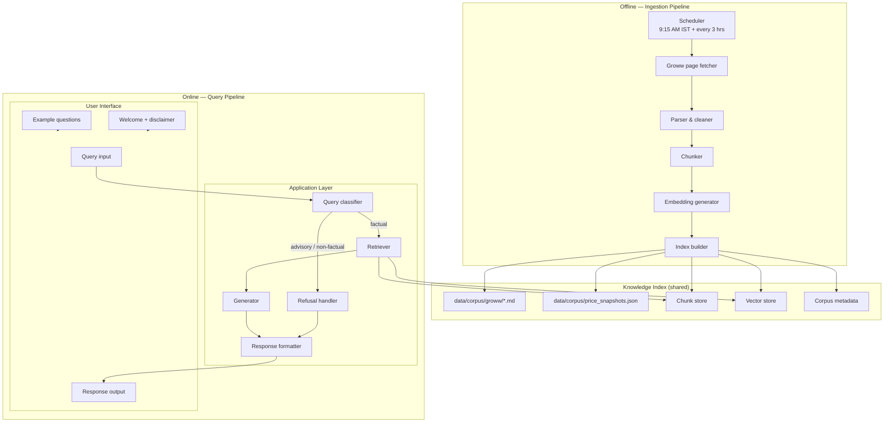
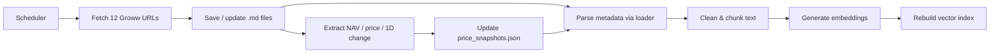
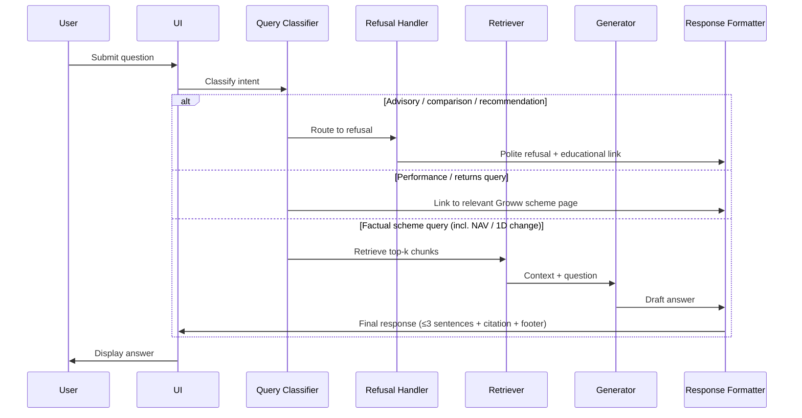

# Architecture: Mutual Fund FAQ Assistant

This document describes the system architecture for the **facts-only HDFC Mutual Fund FAQ assistant**, derived from [ProblemStatement.md](./ProblemStatement.md).

### Implementation status

| Component | Status |
|-----------|--------|
| Corpus fetcher (`fetcher.py`) | **Implemented** |
| Price parser (`price_parser.py`) | **Implemented** |
| Corpus loader (`loader.py`) | **Implemented** |
| Chunker / indexer (`chunker.py`, `indexer.py`) | **Implemented** — 55 chunks, FAISS + BGE-small |
| Query classifier / refusal (`classifier.py`, `handler.py`) | **Implemented** |
| RAG pipeline (`retriever.py`, `generator.py`, `formatter.py`, `pipeline.py`) | **Implemented** |
| Scheduler | Not started |
| UI (Streamlit) | Not started |

---

## Design Goals

| Goal | How the architecture supports it |
|------|----------------------------------|
| Facts-only answers | Retrieval constrained to ingested corpus; prompt and post-processing enforce no advice |
| Source-backed responses | Every chunk carries a Groww URL; response formatter attaches exactly one citation |
| Lightweight RAG | Small corpus (12 pages); local vector index; scheduled refresh keeps data current |
| Fresh data | Scheduler re-fetches Groww pages daily at 9:15 AM IST, then every 3 hours; NAV, prices, and 1D changes extracted each run |
| Compliance | Query classifier for refusals; no PII collection; performance queries deflected to scheme links |
| Transparency | Short answers (≤3 sentences), mandatory citation, last-updated footer |

---

## High-Level Architecture

The system is split into two independently running paths:

| Path | Mode | Trigger | Purpose |
|------|------|---------|---------|
| **Ingestion pipeline** | Offline / batch | Scheduler (9:15 AM IST daily, then every 3 hours) | Fetch Groww pages, update corpus, rebuild index |
| **Query pipeline** | Online / real-time | User question via UI | Classify, retrieve, generate, and format answers |



### Scheduler schedule (IST)

| Run | Time (IST) | Notes |
|-----|------------|-------|
| 1 | **09:15** | First run — aligns with Indian market open |
| 2 | 12:15 | +3 hours |
| 3 | 15:15 | +3 hours |
| 4 | 18:15 | +3 hours |
| 5 | 21:15 | +3 hours |
| 6 | 00:15 | +3 hours (next calendar day) |
| 7 | 03:15 | +3 hours |
| 8 | 06:15 | +3 hours |
| → | 09:15 | Cycle repeats |

**8 ingestion runs per day**, keeping NAV, share prices, 1-day changes, AUM, and scheme details near real-time without blocking user queries.

---

## System Components

### 1. Corpus Layer

**Purpose:** Single source of truth for all factual answers.

| Attribute | Value |
|-----------|-------|
| Location | `data/corpus/groww/` |
| Format | Markdown (one file per Groww URL) |
| Size | 12 documents (7 mutual funds, 3 ETFs, 2 stocks) |
| Metadata per file | `Source URL`, `Title`, scheme name, product type |
| Price snapshot | `data/corpus/price_snapshots.json` — structured NAV, price, and 1D change per product |

Each ingested file begins with a canonical source header:

```
Source URL: https://groww.in/mutual-funds/...
Title: HDFC Defence Fund Direct Growth - NAV, ...
```

This header is parsed at index time and stored as chunk metadata for citations.

#### Price & NAV data (ingested fields)

On each fetch, the pipeline extracts point-in-time pricing from Groww pages and writes `data/corpus/price_snapshots.json`:

| Product type | Fields extracted | Example (HDFC Defence Fund) |
|--------------|------------------|----------------------------|
| **Mutual fund** | `nav`, `nav_date`, `change_1d_pct`, `aum_cr` | NAV ₹28.72, +0.01% 1D, dated 05 Jun '26 |
| **ETF** | `current_price`, `change_1d_abs`, `change_1d_pct`, `previous_close` | ₹243.53, -3.16 (-1.28%) |
| **Stock** | `current_price`, `change_1d_abs`, `change_1d_pct`, `market_cap_cr` | HDFC Bank ₹747.05, -7.15 (-0.95%) |

These fields are also embedded in corpus markdown and will be indexed as chunks tagged with section `nav` or `price_change` for RAG retrieval once Phase 2 chunking is implemented.

---

### 2. Ingestion Pipeline (Offline)

Runs on a **schedule**, not on user queries. The online query pipeline reads the vector index produced here.



**Current scope (Phases 0–2):** fetch → save markdown → extract prices → load metadata → section-first chunking → local BGE embeddings → FAISS index with atomic swap.

#### Scheduler *(Phase 5 — not yet implemented)*

| Attribute | Value |
|-----------|-------|
| First run | **09:15 AM IST** daily (market open) |
| Recurrence | Every **3 hours** after each run |
| Runs per day | 8 |
| Implementation | APScheduler (in-process) or system cron |
| Timezone | `Asia/Kolkata` (IST) |

On each trigger the scheduler will:

1. Fetch all 12 Groww URLs from [ProblemStatement.md](./ProblemStatement.md) — **`python -m src.ingest.fetcher`**
2. Convert HTML → markdown and write to `data/corpus/groww/`
3. Extract NAV, share price, and 1-day change into `data/corpus/price_snapshots.json`
4. Re-chunk, re-embed, and atomically swap the vector index
5. Log run timestamp (`ingested_at`) used in response footers

User queries continue against the **previous index** while a refresh is in progress; the new index is swapped in only after the run completes successfully.

#### Groww page fetcher *(implemented)*

- HTTP fetch of each corpus URL with polite rate limiting (1.5 s between requests)
- HTML-to-markdown conversion via `markdownify` (preserving `Source URL` and `Title` headers)
- **Price extraction:** `price_parser.py` parses NAV block (mutual funds) or live price line (ETFs/stocks) and atomically updates `price_snapshots.json`
- Skip write if content is unchanged (SHA-256 hash check)

**CLI:** `python -m src.ingest.fetcher` — fetch all 12 pages and refresh price snapshots.

#### Corpus loader *(implemented)*

- Reads `.md` files from `data/corpus/groww/`
- Parses `Source URL` and `Title` from canonical header
- Returns `CorpusDocument` objects with `scheme_name`, `product_type`, and body text

**CLI:** `python -m src.ingest.loader` — load all corpus files and print metadata summary.

#### Chunking strategy *(implemented)*

Section-first chunking in `chunker.py` — Groww navigation boilerplate is stripped; factual sections are kept.

- **Hero / summary chunk** per document (NAV, expense ratio, risk, 1D change)
- **Section splits** on `##` / `###` headings (`exit_load`, `min_investment`, `about`, etc.)
- **Sub-split** only when a section exceeds ~600 tokens (~50-token overlap)
- **Yield:** 55 chunks across 12 documents
- **Metadata attached to each chunk:**
  - `source_url`, `scheme_name`, `product_type`, `section`, `ingested_at`
  - `nav` / `current_price` / `change_1d_pct` / `expense_ratio_pct` — from `price_snapshots.json` on pricing sections

#### Vector store *(implemented)*

**FAISS** `IndexFlatIP` over L2-normalized BGE vectors, persisted in `index/` alongside `chunks.json` and `metadata.json`. Atomic directory swap on rebuild. No managed database required.

#### Embeddings *(implemented)*

**Local BGE** via `sentence-transformers` — default `BAAI/bge-small-en-v1.5` (384-dim). No API key required. Documents embedded as raw text; queries use the BGE search instruction prefix. Auto-selects BGE-large only if chunk volume or size grows beyond thresholds.

---

### 3. Query Processing Pipeline (Online)

Every user question follows this path at **request time**. The retriever reads from the index last built by the offline ingestion pipeline — it never fetches Groww pages directly.



#### Step 1 — Query classifier

Determines routing before retrieval:

| Intent | Examples | Action |
|--------|----------|--------|
| **Factual** | "What is the exit load on HDFC Defence Fund?" | Proceed to RAG |
| **Factual (price)** | "What is the latest NAV of HDFC Defence Fund?", "What is the 1-day change for HDFC Silver ETF?" | Proceed to RAG — answer from ingested NAV/price data only |
| **Advisory** | "Should I invest in this fund?" | Refuse |
| **Comparison** | "Which fund is better?" | Refuse |
| **Performance** | "What returns did this fund give last year?", "What is the 3Y CAGR?" | Refuse calculation; return Groww scheme link only |
| **Out of scope** | Unrelated to corpus schemes | Polite decline |

**Classifier rule for price vs performance:** Point-in-time NAV, current share price, and 1-day change are **factual**. Historical returns, CAGR, annualised performance over any period, and return comparisons are **performance** and must be deflected.

Implementation options: keyword/heuristic rules for the milestone, or a small LLM classification call with a strict system prompt.

#### Step 2 — Retriever (online)

Hybrid retrieval in `retriever.py`:

1. **Dense search** — FAISS top-8 over BGE query embedding
2. **Metadata rerank** — scheme boost (+0.15), section boost (+0.10/+0.05) for query-type sections
3. **Section guarantee** — inject matching `chunks.json` row if FAISS missed the preferred section
4. **Structured price injection** — prepend authoritative row from `price_snapshots.json` for NAV/price queries
5. **Threshold filter** — keep chunks ≥ `SIMILARITY_THRESHOLD`; pass top 3 to the generator

Does **not** call Groww or trigger ingestion — read-only access to the index.

#### Step 3 — Generator (Groq LLM)

Calls **Groq API** (`llama-3.3-70b-versatile` by default) via `generator.py`. Requires `GROQ_API_KEY` in `.env`. Classifier and retriever run without any API key.

System prompt constraints:

- Answer **only** from retrieved context
- **Maximum 3 sentences**
- **No investment advice**, opinions, or recommendations
- **No return calculations** or performance comparisons
- If context is insufficient, say so — do not hallucinate

#### Step 4 — Response formatter

Post-processes the LLM output to enforce deliverable requirements:

```
{answer text — max 3 sentences}

Source: {single Groww URL from best-matching chunk}

Last updated from sources: {date from chunk metadata or ingestion date}
```

Validation checks:

- Sentence count ≤ 3
- Exactly one URL from the allowed 12-link corpus
- Disclaimer visible in UI (not repeated in every answer unless required)

---

### 4. Refusal Handler

For advisory and comparison queries, bypass RAG entirely.

**Response template:**

1. Polite acknowledgment
2. Clear statement: *"I can only answer factual questions about HDFC schemes from official Groww pages."*
3. One educational link (e.g. [AMFI investor corner](https://www.amfiindia.com/investor-corner) or [SEBI investor education](https://investor.sebi.gov.in))

No corpus citation required for refusals — the educational link satisfies the guidance requirement from the problem statement.

---

### 5. User Interface (Minimal)

A single-page chat interface:

| Element | Content |
|---------|---------|
| Header | "HDFC Mutual Fund FAQ Assistant" |
| Disclaimer (always visible) | **Facts-only. No investment advice.** |
| Welcome message | Brief explanation of what the assistant can answer |
| Example questions (3) | Pulled from problem statement, e.g. expense ratio, min SIP, exit load |
| Input | Text field + submit button |
| Output | Answer, single source link, last-updated footer |

**Privacy:** No login, no form fields for PAN/Aadhaar/account/OTP/email/phone. Queries are processed in-session only; no persistent user data storage.

Suggested stack for the milestone: **Streamlit** or a minimal **FastAPI + HTML/JS** frontend.

---

## Proposed Project Structure

```
RAG Milestone/
├── Docs/
│   ├── ProblemStatement.md
│   └── Architecture.md          ← this file
├── data/
│   └── corpus/
│       ├── groww/               ← 12 ingested .md files
│       └── price_snapshots.json ← NAV, price, 1D change (refreshed each run)
├── src/
│   ├── scheduler/
│   │   └── jobs.py              ← cron/APScheduler: 9:15 AM IST + every 3 hrs
│   ├── ingest/
│   │   ├── fetcher.py           ← fetch Groww URLs, HTML → markdown, price extract
│   │   ├── price_parser.py      ← parse NAV / price / 1D change → JSON snapshot
│   │   ├── loader.py            ← read & parse corpus files
│   │   ├── chunker.py           ← split documents into chunks
│   │   └── indexer.py           ← build / swap vector index
│   ├── rag/
│   │   ├── retriever.py         ← semantic search
│   │   ├── classifier.py        ← query intent routing
│   │   ├── generator.py         ← LLM answer generation
│   │   └── formatter.py         ← citation & footer enforcement
│   ├── refusal/
│   │   └── handler.py           ← advisory/comparison responses
│   └── app/
│       └── main.py              ← UI entry point
├── index/                       ← persisted vector index (gitignored)
├── requirements.txt
└── README.md
```

---

## Data Flow Summary

**Offline (scheduled — 9:15 AM IST, then every 3 hours):**

```
Scheduler → Fetch Groww URLs → Save .md → Extract price snapshot → [Phase 2: Chunk → Embed → Rebuild index]
```

**Offline (manual — available now):**

```
python -m src.ingest.fetcher   # fetch + price update
python -m src.ingest.loader  # inspect loaded corpus metadata
```

**Online (on every user query):**

```
User question → Classifier → Retriever (read index) → Generator → Formatter → UI
                    ↓
               Refusal handler
```

The two paths share the vector index but never block each other. Ingestion writes; retrieval reads.

---

## Technology Stack

| Layer | Choice | Rationale |
|-------|--------|-----------|
| Language | Python 3.11+ | Ecosystem for RAG, embeddings, UI |
| Embeddings | Local BGE (`BAAI/bge-small-en-v1.5`) via `sentence-transformers` | Free, runs offline; strong on short FAQ passages |
| Vector store | FAISS (local, file-backed) | No infra overhead for 55-chunk corpus |
| LLM | **Groq** (`llama-3.3-70b-versatile`) | Fast inference; facts-only answer generation (Phase 4 only) |
| Scheduler | APScheduler or cron (`Asia/Kolkata`) | 9:15 AM IST daily + every 3 hours ingestion |
| UI | Streamlit | Fast to build; meets minimal UI requirements |
| Config | `.env` — `GROQ_API_KEY` | Required for factual answers; never committed to repo |

### API key usage

| Phase / component | `GROQ_API_KEY` required? |
|-------------------|---------------------------|
| Ingestion, chunking, indexing | No — local BGE embeddings |
| Query classifier & refusal | No — heuristic rules |
| Retriever | No — reads local FAISS index |
| **Generator (factual answers)** | **Yes** |
| Refusal / performance deflection | No — template responses |

---

## Compliance & Safety Controls

Built into the pipeline, not left to the LLM alone:

1. **Corpus boundary** — Retriever only searches indexed Groww pages; no web search
2. **Citation whitelist** — Formatter validates URL against the 12 known Groww links
3. **Advisory blocklist** — Classifier catches "should I invest", "which is better", "recommend", etc.
4. **Performance deflection** — Historical return/CAGR questions get a scheme page link, not computed figures; **current NAV and 1D change are allowed**
5. **Length cap** — Post-process to enforce ≤3 sentences
6. **No PII** — UI and API accept only free-text questions; no identity fields
7. **Price staleness** — Answers citing NAV/price must use ingested values and show last-updated footer

---

## Example End-to-End Flow

**Query:** *"What is the expense ratio of HDFC Defence Fund Direct Growth?"*

1. **Classifier** → factual
2. **Retriever** → chunks from `hdfc-defence-fund-direct-growth.md` containing "Expense ratio" and "0.83%"
3. **Generator** → "The expense ratio of HDFC Defence Fund Direct Growth is 0.83%."
4. **Formatter** → attaches `https://groww.in/mutual-funds/hdfc-defence-fund-direct-growth` and footer date
5. **UI** → renders answer with disclaimer banner

**Query:** *"Should I invest in HDFC Gold ETF FoF?"*

1. **Classifier** → advisory
2. **Refusal handler** → polite decline + AMFI/SEBI link
3. **UI** → renders refusal (no RAG call)

**Query:** *"What is the latest NAV of HDFC Defence Fund Direct Growth?"*

1. **Classifier** → factual (price)
2. **Retriever** → chunks from `hdfc-defence-fund-direct-growth.md` or `price_snapshots.json` metadata containing NAV ₹28.72 and +0.01% 1D
3. **Generator** → "The latest NAV of HDFC Defence Fund Direct Growth is ₹28.72 as of 05 Jun 2026, with a 1-day change of +0.01%."
4. **Formatter** → attaches Groww URL and ingestion footer
5. **UI** → renders answer with disclaimer banner

**Query:** *"What returns did HDFC Defence give over 3 years?"*

1. **Classifier** → performance (historical returns, not point-in-time price)
2. **Refusal handler** → Groww scheme link only; no CAGR figure

---

## Known Limitations

| Limitation | Impact |
|------------|--------|
| Stale data between runs | NAV, prices, and 1D changes may be up to ~3 hours old; mitigated by 3-hour refresh cycle |
| Groww fetch failures | A failed run keeps the previous index and price snapshot; scheduler retries at next interval |
| Groww as sole source | Data accuracy depends on Groww page quality, not AMC primary documents |
| Small corpus (12 pages) | Cannot answer questions about HDFC schemes outside the selected set |
| No ELSS in corpus | Lock-in period queries only apply if an ELSS scheme is added |
| Markdown ingestion noise | Groww pages include navigation boilerplate; chunking must filter low-value sections |
| Scheme name ambiguity | Queries like "HDFC fund" may need disambiguation across multiple schemes |
| Price vs performance boundary | 1D change is factual; multi-period returns and CAGR must still be deflected |

---

## Success Criteria Mapping

| Criterion | Architectural mechanism |
|-----------|-------------------------|
| Accurate factual retrieval | Scheduled ingestion + semantic search over fresh chunks |
| Facts-only responses | Classifier + constrained LLM prompt + refusal handler |
| Valid source citations | Chunk-level `source_url` metadata + formatter validation |
| Proper refusal of advisory queries | Dedicated refusal path before retrieval |
| Clean, minimal UI | Single-page chat with disclaimer and example questions |

---

## Next Steps

1. ~~Implement `fetcher.py` to pull all 12 Groww URLs and save markdown to `data/corpus/groww/`~~ ✓
2. ~~Implement `price_parser.py` and `loader.py`~~ ✓
3. ~~Implement `chunker.py` and `indexer.py` with atomic index swap~~ ✓
4. ~~Wire online path: classifier → retriever → generator (Groq) → formatter~~ ✓
5. Configure `scheduler/jobs.py` — first run at **09:15 IST**, then every **3 hours**
6. Add Streamlit UI with disclaimer and three example questions
7. Validate end-to-end against the example FAQ questions in [ProblemStatement.md](./ProblemStatement.md)
