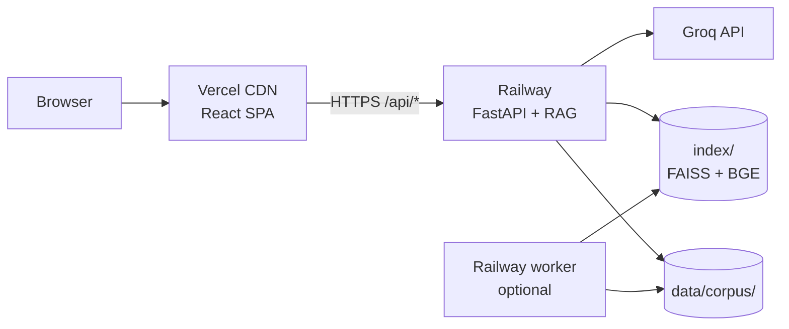

# Deployment Plan: Vercel (Frontend) + Railway (Backend)

Step-by-step guide to deploy the HDFC Mutual Fund FAQ Assistant in production.

| Component | Platform | Source | Public URL |
|-----------|----------|--------|------------|
| React UI | **Vercel** | `frontend/` | `https://your-app.vercel.app` |
| FastAPI + RAG | **Railway** | repo root | `https://your-api.up.railway.app` |
| Scheduler (optional) | **Railway** (2nd service) | repo root | internal — no public URL |

> **Disclaimer:** Facts-only. No investment advice.

---

## Architecture



**Request flow:** The browser loads static assets from Vercel. API calls go directly to Railway using `VITE_API_URL` (set at Vercel build time). Railway validates CORS against your Vercel origin.

**Deploy order:** Railway backend first → note the public URL → Vercel frontend second (needs Railway URL).

---

## Prerequisites

| Item | Notes |
|------|-------|
| GitHub repo | Push this project to GitHub (Vercel and Railway both import from Git) |
| [Groq API key](https://console.groq.com) | Required for factual chat answers |
| [Railway account](https://railway.app) | Backend hosting |
| [Vercel account](https://vercel.com) | Frontend hosting |
| Corpus in repo | `data/corpus/groww/` (12 markdown files) is committed |
| Vector index | `index/` is **gitignored** — must be built on Railway (see below) |

---

## Part 1 — Railway (Backend)

### 1.1 Create the service

1. Log in to [Railway](https://railway.app) → **New Project** → **Deploy from GitHub repo**.
2. Select this repository.
3. **Root directory:** leave as **repo root** (not `frontend/`).
4. Railway detects Python via `requirements.txt` and uses `railway.toml` / `Procfile`.

Existing config in the repo:

```toml
# railway.toml
[build]
builder = "NIXPACKS"

[deploy]
startCommand = "uvicorn src.api.main:app --host 0.0.0.0 --port $PORT"
healthcheckPath = "/api/health"
restartPolicyType = "ON_FAILURE"
```

```procfile
web: uvicorn src.api.main:app --host 0.0.0.0 --port ${PORT:-8000}
```

### 1.2 Build the vector index on deploy

Because `index/` is not in git, add a **build command** in Railway service settings (or extend `railway.toml`):

```toml
[build]
builder = "NIXPACKS"
buildCommand = "pip install -r requirements.txt && python -m src.ingest.indexer"
```

This rebuilds FAISS from the committed corpus (~1–3 min on first deploy; downloads BGE model ~130 MB).

**Alternative — fresh Groww fetch at build:**

```bash
pip install -r requirements.txt && python -m src.scheduler.jobs --once
```

Requires outbound network to Groww during build; slower but updates NAV/prices.

### 1.3 Environment variables (Railway)

In Railway → your service → **Variables**, set:

| Variable | Required | Example / notes |
|----------|----------|-----------------|
| `GROQ_API_KEY` | **Yes** | `gsk_...` from Groq console |
| `LLM_PROVIDER` | No | `groq` (default) |
| `LLM_MODEL` | No | `llama-3.3-70b-versatile` |
| `EMBEDDING_PROVIDER` | No | `bge` (local, no extra API key) |
| `EMBEDDING_MODEL` | No | `auto` |
| `CORS_ORIGINS` | **Yes** | `https://your-app.vercel.app` — exact Vercel URL, no trailing slash |
| `TIMEZONE` | No | `Asia/Kolkata` |
| `GROQ_TIMEOUT_SECONDS` | No | `30` |
| Retriever vars | No | See [`.env.example`](../.env.example) — defaults are fine |

**CORS tip:** After Vercel deploy, add the production URL here. For local dev, include both:

```text
http://localhost:5173,https://your-app.vercel.app
```

### 1.4 Generate public domain

1. Railway → service → **Settings** → **Networking** → **Generate Domain**.
2. Copy the URL, e.g. `https://hdfc-faq-api-production.up.railway.app`.
3. Save this — Vercel needs it as `VITE_API_URL`.

### 1.5 Verify backend

```bash
curl https://your-api.up.railway.app/api/health
```

Expected:

```json
{
  "status": "ok",
  "index_ready": true,
  "groq_configured": true
}
```

If `index_ready` is `false`, the index build failed — check Railway build logs and run `python -m src.ingest.indexer` manually via Railway shell.

```bash
curl https://your-api.up.railway.app/api/ingestion
```

Confirms ingestion audit log (after at least one `--once` run).

---

## Part 2 — Vercel (Frontend)

### 2.1 Create the project

1. Log in to [Vercel](https://vercel.com) → **Add New** → **Project** → import the same GitHub repo.
2. **Root Directory:** set to **`frontend`** (critical — not repo root).
3. **Framework Preset:** Vite (auto-detected).
4. **Build Command:** `npm run build` (default).
5. **Output Directory:** `dist` (default).

`frontend/vercel.json` handles SPA routing (all paths → `index.html`):

```json
{
  "rewrites": [{ "source": "/(.*)", "destination": "/index.html" }]
}
```

### 2.2 Environment variables (Vercel)

In Vercel → Project → **Settings** → **Environment Variables**:

| Variable | Required | Value |
|----------|----------|-------|
| `VITE_API_URL` | **Yes** | `https://your-api.up.railway.app` — Railway public URL, **no trailing slash** |

Apply to **Production**, **Preview**, and **Development** as needed.

> Vite bakes `VITE_*` vars in at **build time**. After changing `VITE_API_URL`, trigger a **Redeploy**.

### 2.3 Deploy

Click **Deploy**. Vercel builds `frontend/` and serves the SPA from the CDN.

Production URL example: `https://hdfc-faq-assistant.vercel.app`

### 2.4 Wire CORS (round trip)

1. Copy your final Vercel URL.
2. Railway → **Variables** → set `CORS_ORIGINS=https://your-app.vercel.app`.
3. Redeploy or restart the Railway service so env vars reload.

### 2.5 Verify frontend

1. Open `https://your-app.vercel.app/chat`.
2. Confirm no CORS errors in browser DevTools → Network.
3. Ask: *"What is the expense ratio of HDFC Defence Fund Direct Growth?"*
4. Expect a factual answer with source link and last-updated footer.

---

## Part 3 — Scheduler (Optional, Recommended)

The API service alone does **not** refresh Groww data. For production freshness (8×/day IST), add a **second Railway service** from the same repo:

| Setting | Value |
|---------|-------|
| Root directory | repo root |
| Start command | `python -m src.scheduler.jobs --daemon` |
| Public domain | **None** (worker only) |
| Variables | Same as backend (`GROQ_API_KEY`, `TIMEZONE`, etc.) — no `CORS_ORIGINS` needed |

**Persistent storage:** Mount a Railway volume at `/app/index` and `/app/data` if you want index and `ingestion_log.json` to survive redeploys. Without a volume, each redeploy rebuilds the index from corpus.

**Cron alternative:** Use Railway cron or an external cron to hit:

```bash
python -m src.scheduler.jobs --once
```

Audit trail: `data/ingestion_log.json` and `GET /api/ingestion`.

---

## Environment variable summary

```text
┌─────────────────────────────────────────────────────────────┐
│  Vercel (frontend)                                          │
│  VITE_API_URL = https://<railway-domain>                    │
└──────────────────────────────┬──────────────────────────────┘
                               │ HTTPS
                               ▼
┌─────────────────────────────────────────────────────────────┐
│  Railway (backend)                                          │
│  GROQ_API_KEY = gsk_...                                     │
│  CORS_ORIGINS = https://<vercel-domain>                     │
│  + optional vars from .env.example                          │
└─────────────────────────────────────────────────────────────┘
```

---

## Post-deploy checklist

| Step | Command / action | Expected |
|------|------------------|----------|
| Backend health | `curl …/api/health` | `"status":"ok"`, `"index_ready":true` |
| Groq configured | same response | `"groq_configured":true` |
| Bootstrap | `curl …/api/bootstrap` | 6 suggested prompts, `index_ready: true` |
| Chat | POST `…/api/chat` with a factual question | Answer + `source_url` + `last_updated` |
| Frontend loads | Open Vercel `/chat` | No red CORS errors |
| Refusal | Ask *"Should I invest…?"* | Refusal, no RAG hallucination |
| Ingestion log | `curl …/api/ingestion` | At least one run after `--once` or scheduler |

---

## Troubleshooting

| Symptom | Likely cause | Fix |
|---------|--------------|-----|
| CORS error in browser | `CORS_ORIGINS` missing or wrong Vercel URL | Set exact origin on Railway; restart service |
| `index_ready: false` | Index not built on deploy | Add `buildCommand` with `python -m src.ingest.indexer`; check build logs |
| `groq_configured: false` | `GROQ_API_KEY` missing or not loaded | Set variable on Railway; redeploy (env loaded at startup) |
| Chat returns empty / error | Wrong `VITE_API_URL` | Fix on Vercel; **redeploy** frontend |
| API calls go to wrong host | Stale Vercel build | Redeploy after changing `VITE_API_URL` |
| Slow first chat response | BGE model cold start (~130 MB) | Normal on Railway; warm with health check ping |
| Stale NAV dates | Scheduler not running | Add worker service or run `--once` periodically |
| Fund card ≠ answer text | Old backend before cache fix | Ensure latest `src/app/data.py` is deployed |

---

## Cost and scaling notes

| Resource | Free tier considerations |
|----------|-------------------------|
| **Vercel** | Static SPA — generous free tier for hobby projects |
| **Railway** | API + optional worker consume compute; BGE model increases memory (~512 MB–1 GB recommended) |
| **Groq** | Pay-per-token; small FAQ corpus keeps usage low |

---

## Related docs

- [README.md](../README.md) — local setup and run commands
- [frontend/README.md](../frontend/README.md) — frontend-specific notes
- [Architecture.md](./Architecture.md) — system design
- [known-issues.md](./known-issues.md) — production limitations
- [implementationplan.md](./implementationplan.md) — phase history and config reference

---

## Quick reference commands

```bash
# Local smoke test before deploy
uvicorn src.api.main:app --port 8000
cd frontend && VITE_API_URL=http://localhost:8000 npm run dev

# Build index locally (same as Railway build step)
python -m src.ingest.indexer

# Full refresh (fetch Groww + re-index)
python -m src.scheduler.jobs --once

# Production health
curl https://YOUR-RAILWAY-URL/api/health
curl https://YOUR-RAILWAY-URL/api/ingestion
```
