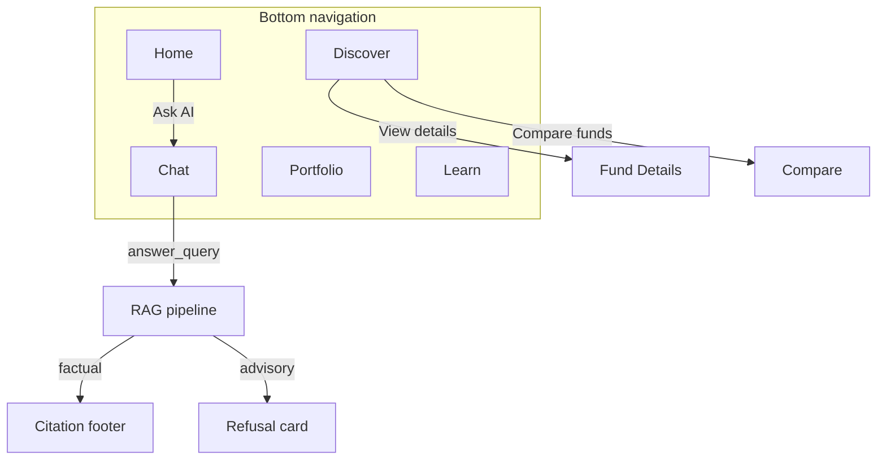

# Design System — HDFC Mutual Fund Assistant

This document describes the UI design for the HDFC Mutual Fund FAQ Assistant: an Apple Human Interface Guidelines (HIG)–aligned experience with Groww-inspired branding. It reflects the **React frontend** (`frontend/`) and serves as the Figma-ready reference for designers and developers.

**North star:** *Apple-designed wealth management for modern investors.*

### Tech stack

| Layer | Technology | Hosting |
|-------|------------|---------|
| Frontend | **React 19 + TypeScript + Vite** | Vercel |
| Backend API | **FastAPI** (`src/api/`) | Railway |
| RAG pipeline | Python (`src/rag/`) | Railway (same service) |

Related files:

| File | Purpose |
|------|---------|
| [`design-system/tokens.css`](./design-system/tokens.css) | CSS custom properties (light + dark) |
| [`design-system/components.md`](./design-system/components.md) | Component anatomy quick reference |
| [`design-system/screens.md`](./design-system/screens.md) | Screen wireframes |
| [`frontend/src/styles/`](../frontend/src/styles/) | React app tokens + global CSS |
| [`frontend/src/components/`](../frontend/src/components/) | React UI components |
| [`src/api/main.py`](../src/api/main.py) | REST API for chat, funds, bootstrap |
| [`src/app/main.py`](../src/app/main.py) | Legacy Streamlit UI (optional local dev) |

---

## 1. Design direction

| Principle | Specification |
|-----------|---------------|
| Simplicity | Large titles, generous whitespace, one primary action per screen |
| Trust | Persistent disclaimer, citations, last-updated footers on every factual answer |
| Depth | Layered cards, soft shadows, subtle glass (`backdrop-filter: blur(20px)` at ~72% opacity) |
| Motion | 200–350 ms ease-out transitions; honour `prefers-reduced-motion` |
| Corners | 12–24 px radius depending on element scale |
| Typography | SF Pro system stack |
| Spacing | Apple 4 pt grid (base unit 4 px) |
| Max width | 768 px centred content on desktop; mobile-first at 390 × 844 |

---

## 2. Brand & color

### 2.1 Palette

| Token | Light | Dark | Usage |
|-------|-------|------|-------|
| `--color-primary` | `#5367F5` | `#6B7FF7` | CTAs, links, active tab, focus rings, progress fills |
| `--color-primary-muted` | `#5367F514` | `#6B7FF726` | User chat bubbles, selected chips, badge backgrounds |
| `--color-success` | `#00C853` | `#00E676` | **Gains only** — positive P&L, up arrows, goal progress |
| `--color-warning` | `#FFB300` | `#FFC107` | Disclaimer accent, alerts, refusal borders |
| `--color-error` | `#E53935` | `#EF5350` | Losses, errors, negative 1D change |
| `--color-bg` | `#F7F8FA` | `#0D0D0F` | Page background |
| `--color-surface` | `#FFFFFF` | `#1C1C1E` | Cards, assistant bubbles |
| `--color-surface-elevated` | `#FFFFFF` | `#2C2C2E` | Modals, elevated sheets |
| `--color-text-primary` | `#1A1A2E` | `#F5F5F7` | Headlines, body |
| `--color-text-secondary` | `#6B7280` | `#98989D` | Captions, metadata, footers |
| `--color-separator` | `#E5E7EB` | `#38383A` | Dividers, card borders |
| `--color-glass` | `rgba(255,255,255,0.72)` | `rgba(28,28,30,0.72)` | Insight cards, nav overlays |

### 2.2 Color rules

1. **Green is reserved for gains.** Use `--color-success` only for portfolio gains, positive 1D change, and goal progress — never for navigation or generic CTAs.
2. **Primary actions use Groww Blue.** Buttons, links, and active states use `--color-primary`.
3. **Red indicates loss, not danger CTAs.** Negative price movement and portfolio loss use `--color-error`; destructive actions are out of scope for this milestone.
4. **Comparison views stay neutral.** Side-by-side fund comparison never uses green/red to imply a “winner.”

---

## 3. Typography

**Font stack:** `-apple-system, BlinkMacSystemFont, "SF Pro Text", "SF Pro Display", "Helvetica Neue", sans-serif`

| Style | Size | Weight | Line height | Use |
|-------|------|--------|-------------|-----|
| Large Title | 34 px | 700 | 41 px | Screen titles (Home, Chat, Discover) |
| Title 1 | 28 px | 700 | 34 px | Portfolio value, section heroes |
| Title 2 | 22 px | 600 | 28 px | Fund names, card titles |
| Title 3 | 20 px | 600 | 25 px | Sub-sections |
| Headline | 17 px | 600 | 22 px | List rows, NAV/price |
| Body | 17 px | 400 | 22 px | Chat messages, descriptions |
| Callout | 16 px | 400 | 21 px | Secondary body, comparison values |
| Subhead | 15 px | 400 | 20 px | Labels, filter chips |
| Footnote | 13 px | 400 | 18 px | Citations, expense ratio, disclaimers |
| Caption | 12 px | 400 | 16 px | Badges, timestamps, “DEMO PORTFOLIO” labels |

CSS shorthand tokens: `--text-large-title`, `--text-title-1`, … `--text-caption` (see `tokens.css`).

---

## 4. Spacing, radius & elevation

### 4.1 Spacing (4 pt grid)

| Token | Value | Use |
|-------|-------|-----|
| `--space-xs` | 4 px | Icon padding |
| `--space-sm` | 8 px | Inline gaps, chip padding |
| `--space-md` | 16 px | Card padding, list insets |
| `--space-lg` | 24 px | Section gaps, chat thread spacing |
| `--space-xl` | 32 px | Screen horizontal margin |
| `--space-2xl` | 48 px | Below large titles |

### 4.2 Corner radius

| Token | Value | Use |
|-------|-------|-----|
| `--radius-sm` | 12 px | Badges, chips, disclaimer |
| `--radius-md` | 16 px | Buttons, inputs, chat bubbles |
| `--radius-lg` | 20 px | Fund cards, portfolio widgets |
| `--radius-xl` | 24 px | Bottom sheets, modals |

### 4.3 Shadows

| Token | Value | Use |
|-------|-------|-----|
| `--shadow-sm` | `0 1px 3px rgba(0,0,0,0.08)` | Resting cards |
| `--shadow-md` | `0 4px 16px rgba(0,0,0,0.10)` | Hover cards, FAB |
| `--shadow-lg` | `0 8px 32px rgba(0,0,0,0.12)` | Sheets, modals |

Dark mode uses stronger shadow opacity (see `tokens.css`).

### 4.4 Motion

| Token | Value | Use |
|-------|-------|-----|
| `--motion-fast` | 200 ms ease-out | Hover shadow, chip select |
| `--motion-normal` | 350 ms ease-out | Progress bars, screen transitions |

Reduced motion: all animations collapse to 0.01 ms when `prefers-reduced-motion: reduce`.

---

## 5. Dark mode

Dark mode swaps semantic tokens via `[data-theme="dark"]` on the app shell. The Streamlit app exposes a **Dark** toggle that re-injects CSS with the appropriate theme attribute.

| Element | Light | Dark |
|---------|-------|------|
| Background | `#F7F8FA` | `#0D0D0F` |
| Card surface | White | `#1C1C1E` |
| Primary text | `#1A1A2E` | `#F5F5F7` |
| Primary blue | `#5367F5` | `#6B7FF7` (slightly lighter for contrast) |

All components consume CSS variables — no hard-coded hex in component HTML except chart segment colours in the demo allocation donut.

---

## 6. Information architecture



| Screen | Route key | Status | Description |
|--------|-----------|--------|-------------|
| Home | `home` | Shell | Demo portfolio, goal progress, AI insight, “Ask AI” CTA |
| Discover | `discover` | Read-only | Search, category filter, 12-scheme grid |
| Chat | `chat` | **Full MVP** | Suggested prompts, thread, `st.chat_input`, pipeline integration |
| Portfolio | `portfolio` | Demo | Mock allocation chart, SIP placeholder |
| Learn | `learn` | Static | Educational cards, AMFI/SEBI links |
| Fund Details | `detail` | Read-only | Price snapshot + Groww performance link |
| Compare | `compare` | Factual | Side-by-side expense ratio, NAV, AUM — no advice |

---

## 7. Component library

### 7.1 Disclaimer banner

**Class:** `.hdfc-disclaimer`  
**Always visible** on Home, Chat, and all primary screens.

```
┌──────────────────────────────────────┐
▌ Facts-only. No investment advice.    │
│ Answers sourced from Groww pages.    │
└──────────────────────────────────────┘
  ↑ 4 px warning-colour left border
```

- Background: `--color-surface`
- Border-left: 4 px solid `--color-warning`
- Radius: `--radius-sm`
- Role: `note`, `aria-label="Disclaimer"`

### 7.2 Fund card

**Class:** `.hdfc-card .hdfc-fund-card`

| Zone | Typography | Notes |
|------|------------|-------|
| Category badge | Caption | Mutual Fund / ETF / Stock — primary muted pill |
| Scheme name | Title 2 (17 px) | Truncate on compact grid |
| NAV / price | Headline | ₹ formatted |
| 1D change | Footnote pill | `.gain` → green, `.loss` → red, `.neutral` → grey |
| Expense ratio | Footnote | Hidden in compact grid mode |
| AUM / market cap | Footnote | Full card only |

Grid layout: `.hdfc-fund-grid` — `repeat(auto-fill, minmax(160px, 1fr))`.

### 7.3 Chat bubble

**Classes:** `.hdfc-bubble-row`, `.hdfc-bubble`

| Role | Alignment | Background | Special |
|------|-----------|------------|---------|
| User | Right | `--color-primary-muted` | Bottom-right radius 4 px |
| Assistant | Left | `--color-surface` + `--shadow-sm` | Bottom-left radius 4 px |
| Refusal | Left | Same + `--color-warning` border | Advisory/comparison responses |

Max width 85%. Citation block (`.hdfc-citation`) below assistant text when `Source:` is present.

### 7.4 AI insight card

**Class:** `.hdfc-card .hdfc-glass`

Glass effect for welcome and insight messages. Caption label “AI INSIGHT”, title + secondary body.

### 7.5 Portfolio widget

**Class:** `.hdfc-card` with `.hdfc-portfolio-value` (Title 1)

Demo data only. Gain/loss line uses `.hdfc-gain-positive` (green) or `.hdfc-gain-negative` (red). Labelled “DEMO PORTFOLIO” in caption.

### 7.6 Goal card

Progress track (`.hdfc-progress-track`) with primary-colour fill. Shows target, current, and deadline — illustrative only.

### 7.7 Comparison card

Two-column grid (`.hdfc-compare-grid`). Fields: NAV/price, 1D change, expense ratio, AUM/market cap. Footer: *“Factual comparison only — not a recommendation.”*

### 7.8 Allocation chart

CSS conic-gradient donut (120 × 120 px) + legend dots. Demo segments: Equity 55%, Debt 25%, Gold 12%, Cash 8%.

### 7.9 Suggested prompts

Implemented as Streamlit secondary buttons in a 2-column layout. Six pre-populated factual questions from the Problem Statement and corpus.

### 7.10 Navigation

Five bottom tabs: **Home · Discover · Chat · Portfolio · Learn**. Active tab uses primary button style; inactive uses secondary. Minimum touch target 44 px via full-width buttons. **Compare funds** accessed via header button on non-Chat screens.

### 7.11 Citation footer

Rendered inside assistant bubbles when the pipeline returns a formatted response:

```
Source: Groww          ← primary-colour link
Last updated: 05 Jun 2026
```

### 7.12 Refusal card

Assistant bubble with warning border when response matches refusal markers (AMFI/SEBI links, advisory language). No fund card shown.

### 7.13 Loading skeleton

`.hdfc-skeleton` — shimmer animation on assistant side while awaiting Groq response. Disabled under reduced motion.

---

## 8. Screen specifications

### 8.1 Home

```
┌─────────────────────────────┐
│ [Dark toggle]               │
│ Home (Large Title)          │
│ ┌─ Disclaimer ────────────┐ │
│ └─────────────────────────┘ │
│ ┌─ Demo Portfolio ────────┐ │
│ │ ₹842,350  +₹92,350 XIRR │ │
│ └─────────────────────────┘ │
│ ┌─ Goal Progress ─────────┐ │
│ └─────────────────────────┘ │
│ ┌─ AI Insight (glass) ────┐ │
│ └─────────────────────────┘ │
│ [ Ask AI → Chat ]           │
├─────────────────────────────┤
│ Home | Discover | Chat | …  │
└─────────────────────────────┘
```

### 8.2 Chat (primary MVP)

```
┌─────────────────────────────┐
│ Chat                        │
│ Disclaimer                  │
│ Welcome insight card        │
│ [Prompt] [Prompt]           │
│ [Prompt] [Prompt]           │
│         ┌──────────────┐    │
│         │ User bubble  │    │
│ ┌──────────────┐            │
│ │ Assistant    │            │
│ │ + citation   │            │
│ └──────────────┘            │
│ ┌─ Fund card ──┐  (optional) │
│ └──────────────┘            │
│ ┌─────────────────────────┐ │
│ │ Ask a factual question… │ │
│ └─────────────────────────┘ │
├─────────────────────────────┤
│ Bottom tabs                 │
└─────────────────────────────┘
```

**Integration:** `answer_query()` → `parse_response()` → bubble + optional fund card from `detect_product_from_text()`.

### 8.3 Discover

- Pill search input (collapsed label)
- Segmented control: All · Mutual Fund · ETF · Stock
- Responsive fund card grid (12 HDFC schemes)
- Select + “View details” → Fund Details screen

### 8.4 Fund Details

- Back to Discover
- Full fund card + Groww link for returns/performance
- Source URL footnote

### 8.5 Compare

- Two scheme selectors
- Comparison card with neutral styling
- Accessible from “Compare funds” button

### 8.6 Portfolio

- Demo banner: “DEMO DATA — no login or PII collected”
- Portfolio widget + allocation donut + SIP insight card

### 8.7 Learn

- Three educational cards (expense ratio, exit load, risk)
- Official resources card with AMFI + SEBI links

---

## 9. UX principles

| Principle | Implementation |
|-----------|----------------|
| Mobile-first | 390 px baseline; max-width 768 px container |
| Accessibility (WCAG AA) | Semantic roles, 4.5:1 body contrast via tokens, 44 px touch targets |
| Decision-support | Comparison shows facts side-by-side; no “best fund” copy |
| Educational | Learn tab + refusal links to AMFI/SEBI |
| Low cognitive load | Suggested prompts, one CTA per screen, progressive disclosure |
| Trust | Disclaimer always visible; citations on every factual answer |

---

## 10. Compliance & product boundaries

The UI presents a wealth-app shell but the **backend enforces facts-only behaviour**:

| User intent | UI behaviour |
|-------------|--------------|
| Factual FAQ (expense ratio, NAV, exit load) | RAG answer + citation footer |
| Advisory (“Should I invest?”) | Refusal bubble + AMFI/SEBI links |
| Comparison (“Which fund is better?”) | Refusal — Compare screen is factual fields only |
| Performance / returns | Deflection link to Groww scheme page |
| Portfolio / goals | Demo mock data — no real accounts |
| SIP management | Educational copy + link to Groww |

**Privacy:** No login. No PAN, Aadhaar, account, OTP, email, or phone fields. Chat history is session-only.

---

## 11. Figma export guide

When recreating in Figma:

1. **Create colour styles** from Section 2.1 (light + dark collections).
2. **Create text styles** from Section 3 (10 styles).
3. **Create effect styles** for `--shadow-sm/md/lg`.
4. **Auto-layout** cards with 16 px padding, 20 px radius, 8 px vertical gap between rows.
5. **Component variants:**
   - Fund card: `default | compact | hover`
   - Chat bubble: `user | assistant | refusal`
   - Change pill: `gain | loss | neutral`
   - Tab bar item: `active | inactive`
6. **Prototype flows:** Home → Chat, Discover → Details, Discover → Compare.
7. **Frame size:** 390 × 844 (iPhone 14) + 768 × 1024 (tablet).

Source tokens for dev handoff: [`design-system/tokens.css`](./design-system/tokens.css).

---

## 12. Running the UI

### Production (Vercel + Railway)

**Backend (Railway):**
```bash
uvicorn src.api.main:app --host 0.0.0.0 --port $PORT
```

**Frontend (Vercel):** set `VITE_API_URL` to your Railway URL. See [`frontend/README.md`](../frontend/README.md).

### Local development

Terminal 1 — API:
```bash
source .venv/bin/activate
uvicorn src.api.main:app --reload --port 8000
```

Terminal 2 — React:
```bash
cd frontend && npm install && npm run dev
```

Open http://localhost:5173 (Vite proxies `/api` to port 8000).

### Legacy Streamlit (optional)

```bash
streamlit run src/app/main.py
```

---

## 13. File map (implementation)

| Module | Responsibility |
|--------|----------------|
| `frontend/src/App.tsx` | React Router, page routing |
| `frontend/src/pages/` | Home, Chat, Discover, Compare, Portfolio, Learn |
| `frontend/src/components/` | FundCard, ChatBubble, widgets, nav |
| `frontend/src/api/client.ts` | Fetch wrapper for Railway API |
| `src/api/main.py` | FastAPI app, CORS, routes |
| `src/api/service.py` | Chat, products, bootstrap logic |
| `src/rag/pipeline.py` | RAG orchestration (unchanged) |
| `src/app/main.py` | Legacy Streamlit UI |
