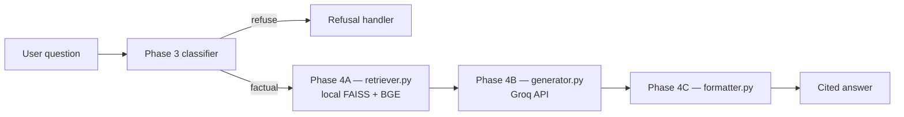
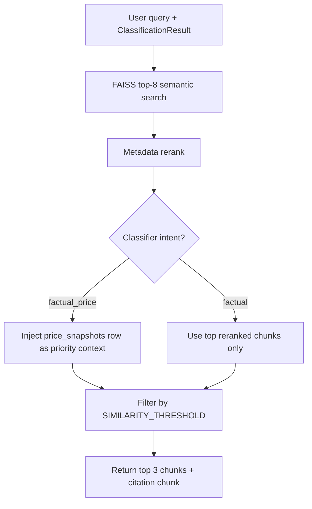
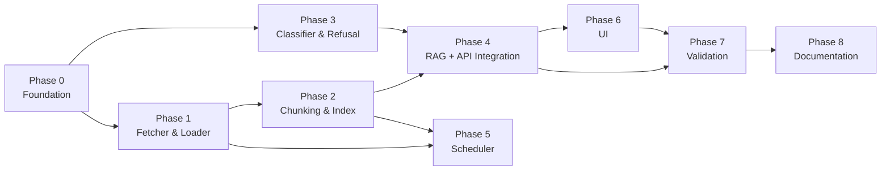

# Implementation Plan: HDFC Mutual Fund FAQ Assistant

This document is a **phase-wise implementation plan** for the facts-only RAG assistant described in [ProblemStatement.md](./ProblemStatement.md) and [Architecture.md](./Architecture.md).

### Implementation status

| Phase | Status | Notes |
|-------|--------|-------|
| 0 — Project foundation | **Complete** | Config, deps, URL whitelist, price schema |
| 1 — Corpus fetcher & loader | **Complete** | `fetcher.py`, `price_parser.py`, `loader.py` |
| 2 — Chunking & indexing | **Complete** | 55 chunks, BGE-small index built, 5/5 sample searches pass |
| 3 — Query classifier & refusal | **Complete** | Heuristic classifier, refusal handler, 26 unit tests pass |
| 4 — RAG + API integration | **Complete** | Local hybrid retrieval + Groq answer generation + formatter + `pipeline.py` |
| 5 — Scheduler | **Complete** | APScheduler 8×/day IST; `--once` and `--daemon` modes |
| 6 — User interface | **Complete** | React (Vercel) + FastAPI (Railway); legacy Streamlit kept |
| 7 — Validation & hardening | **Complete** | 34+ automated tests; compliance module; known-issues doc |
| 8 — Documentation & delivery | **Complete** | Root `README.md`, `.env.example`, linked docs |

---

## Overview

| Attribute | Value |
|-----------|-------|
| **Goal** | Build a lightweight, facts-only FAQ assistant over 12 Groww pages |
| **Approach** | Two-path architecture — offline ingestion + online query pipeline |
| **Stack** | Python 3.11+, FAISS, BGE embeddings (local) + Groq LLM, **React + FastAPI**, APScheduler |
| **Corpus** | 12 HDFC schemes (7 mutual funds, 3 ETFs, 2 stocks) — already ingested locally |
| **Price data** | `data/corpus/price_snapshots.json` — NAV, share price, 1D change per product |

### API key usage by phase

| Phase | Needs `GROQ_API_KEY`? | Why |
|-------|----------------------|-----|
| 0–2 | **No** | Config, fetch, chunk, and index use local files; embeddings default to **local BGE** (no cloud API) |
| 3 | **No** | Query classifier and refusal handler use **keyword/heuristic rules** only |
| **4A — Local RAG** | **No** | `retriever.py` — local FAISS + BGE query embedding + metadata rerank |
| **4B — Groq API** | **Yes** | `generator.py` — Groq LLM turns retrieved context into a ≤3-sentence answer |
| **4C — Formatting** | **No** | `formatter.py` + `pipeline.py` — citation, footer, orchestration |
| 5–6 | **No** (scheduler/UI) | Scheduler rebuilds index locally; Streamlit calls `answer_query()` |
| 7–8 | **No** | Validation and docs |

> **Summary:** Phase 4 = **local RAG retrieval** (Part A, no API) + **Groq API integration** (Part B) + **formatting/orchestration** (Part C, no API). Only Part B needs `GROQ_API_KEY`.

### Implementation Phases at a Glance

| Phase | Name | Outcome |
|-------|------|---------|
| 0 | Project foundation | Runnable repo, config, dependencies |
| 1 | Corpus & fetcher | Fresh Groww pages saved as markdown |
| 2 | Chunking & indexing | Searchable vector index with section-first chunks |
| 3 | Query classifier & refusal | Intent routing before RAG |
| 4 | RAG + API integration | Local retrieve → Groq generate → format answers |
| 5 | Scheduler | Automated 8×/day index refresh (IST) |
| 6 | User interface | Apple HIG + Groww design system; AI Chat MVP + shell screens |
| 7 | Validation & hardening | End-to-end tests against success criteria |
| 8 | Documentation & delivery | README, limitations, run instructions |

---

## Phase 0: Project Foundation

**Goal:** Establish project structure, dependencies, and configuration so later phases can plug in cleanly.

### Tasks

1. **Scaffold directory layout** per Architecture.md:
   ```
   src/
     scheduler/jobs.py
     ingest/{fetcher,loader,chunker,indexer}.py
     rag/{retriever,classifier,generator,formatter}.py
     refusal/handler.py
     app/main.py
   data/corpus/groww/     ← already populated (12 files)
   data/corpus/price_snapshots.json  ← NAV / price / 1D change
   index/                 ← gitignored vector store
   ```

2. **Create `requirements.txt`** with pinned versions:
   - `openai`, `python-dotenv`
   - `faiss-cpu` or `chromadb`
   - `sentence-transformers` (optional fallback for embeddings)
   - `streamlit`
   - `apscheduler`, `pytz`
   - `httpx` or `requests`, `beautifulsoup4`, `markdownify` (HTML → markdown)
   - `tiktoken` (token counting for chunking)

3. **Configuration**
   - `.env.example` with `GROQ_API_KEY`, embedding model, Groq LLM model
   - `src/config.py` — load env vars, define corpus URL whitelist (12 links from ProblemStatement.md), timezone (`Asia/Kolkata`)
   - Add `index/` and `.env` to `.gitignore`

4. **Corpus URL registry**
   - Centralize the 12 Groww URLs and local filename mappings in `src/config.py` or `src/ingest/urls.py`
   - Single source of truth for citation whitelist validation

5. **Price snapshot schema**
   - Define JSON schema for `price_snapshots.json` (mutual fund NAV fields vs ETF/stock price fields)
   - Bootstrap file populated from current corpus (see ProblemStatement.md price snapshot table)

### Deliverables

- [x] Project structure created
- [x] `requirements.txt` installable via `pip install -r requirements.txt`
- [x] `.env.example` documented
- [x] URL whitelist module with all 12 corpus links
- [x] `price_snapshots.json` schema documented and bootstrap file present

### Exit Criteria

- `python -c "import src.config"` succeeds
- All 12 corpus `.md` files readable from `data/corpus/groww/`

---

## Phase 1: Corpus Fetcher & Loader

**Goal:** Fetch Groww pages, convert to markdown with canonical headers, extract NAV/price/1D change, and parse metadata for indexing.

### Tasks

1. **`src/ingest/fetcher.py`**
   - HTTP fetch each of the 12 Groww URLs with polite rate limiting (e.g. 1–2 s between requests)
   - HTML → markdown conversion preserving key content (tables, headings)
   - Prepend canonical header to each file:
     ```
     Source URL: https://groww.in/mutual-funds/...
     Title: HDFC Defence Fund Direct Growth - NAV, ...
     ```
   - Write/update files in `data/corpus/groww/`
   - Optional: content-hash check — skip write and re-index if unchanged

2. **`src/ingest/price_parser.py`**
   - Parse pricing fields from fetched HTML or saved markdown:
     - **Mutual funds:** `nav`, `nav_date`, `change_1d_pct`, `aum_cr`
     - **ETFs / stocks:** `current_price`, `change_1d_abs`, `change_1d_pct`, `previous_close` (ETFs)
   - Update `data/corpus/price_snapshots.json` atomically after each fetch run
   - Log parse failures per URL without blocking other products

3. **`src/ingest/loader.py`**
   - Read all `.md` files from `data/corpus/groww/`
   - Parse `Source URL` and `Title` from header
   - Derive metadata: `scheme_name`, `product_type` (mutual fund / ETF / stock)
   - Return structured document objects for chunker

4. **Manual bootstrap**
   - Run fetcher once to verify all 12 pages fetch successfully
   - Confirm existing ingested files match expected format
   - Verify `price_snapshots.json` matches Groww values in corpus markdown

### Deliverables

- [x] `fetcher.py` — fetches and saves all 12 Groww pages
- [x] `price_parser.py` — extracts NAV/price/1D change into JSON snapshot
- [x] `loader.py` — parses headers and metadata from corpus files
- [x] CLI entry points:
  - `python -m src.ingest.fetcher` — one-shot fetch + price update
  - `python -m src.ingest.loader` — load and summarize corpus metadata

### Exit Criteria

- All 12 files have valid `Source URL` and `Title` headers
- `price_snapshots.json` contains all 12 products with correct NAV or price fields
- Loader returns correct metadata for each document
- Fetch failures logged without corrupting existing corpus or price snapshot

---

## Phase 2: Chunking & Vector Index

**Goal:** Split corpus into searchable chunks with rich metadata and build a persisted vector index.

**Strategy (based on corpus review):** Section-first chunking — not fixed token windows. FAQ facts live in small named sections; holdings tables and performance calculators are noise.

### Chunking approach

1. **Pre-process**
   - Strip Groww site navigation (everything before the first `#` heading)
   - Simplify markdown links to plain text

2. **Hero / summary chunk (always one per document)**
   - Boundary: `# {Scheme}` → up to the first `###` or `##`
   - Contains: risk, NAV/price, 1D change, min SIP, AUM, expense ratio
   - Metadata: `section: summary`; pricing fields from `price_snapshots.json`

3. **Section splits on `###` / `##` headings**
   - Keep: `Minimum investments`, `Exit load`, `About {scheme}`, `Fundamentals`, `Performance`
   - Skip: `Return calculator`, `Holdings`, `Compare similar`, `Fund house`, `Category returns`, `Similar ETFs/stocks`, `About Groww`, `Shareholding Pattern`, `Financial performance`

4. **Sub-split only when a kept section exceeds ~600 tokens**
   - Split on `#####` headings, then paragraphs
   - Apply ~50-token overlap only across forced sub-splits

5. **Hybrid retrieval**
   - NAV / price / expense ratio: prefer `price_snapshots.json`
   - Exit load, benchmark, min SIP, risk: RAG over text chunks (`exit_load`, `about`, `min_investment`)

**Expected yield:** ~55 chunks across 12 documents (verified at build time).

### Embedding model: BGE-small (auto-selected)

We use **`BAAI/bge-small-en-v1.5`** via `sentence-transformers` (local, no API cost) instead of OpenAI `text-embedding-3-small`.

| Factor | This corpus | BGE-small fit |
|--------|-------------|---------------|
| Chunk count | **55** (≤100 threshold) | Small index — no need for larger model capacity |
| Avg chunk size | **~144 tokens** (≤400 threshold) | Short, focused FAQ sections embed well in 384 dimensions |
| Max chunk size | **487 tokens** (≤600 threshold) | No oversized passages forcing higher-dimensional embeddings |
| Query type | Factual lookup (expense ratio, NAV, exit load) | BGE-small scores strongly on retrieval benchmarks for short passages |
| Cost / latency | 8×/day re-index + dev iteration | Free, runs locally; ~130MB model vs ~1.3GB for BGE-large |
| Scale headroom | 12 Groww pages | FAISS flat index over 55 vectors is trivial either way |

**When BGE-large auto-selects:** chunk count exceeds 100, average chunk size exceeds 400 tokens, or any single chunk exceeds 600 tokens — e.g. if we stop filtering holdings tables or ingest many more schemes.

Configuration (`src/ingest/embeddings.py`):

```bash
EMBEDDING_PROVIDER=bge      # default — local, free
EMBEDDING_MODEL=auto        # auto → bge-small for this corpus
```

### Tasks

1. **`src/ingest/chunker.py`**
   - Implement section-first splitting per the approach above
   - Attach metadata to each chunk:
     - `source_url`, `scheme_name`, `product_type`, `section`, `ingested_at`
     - Optional pricing fields from `price_snapshots.json` on summary / price / fundamentals chunks
   - Build URL lookup table for classifier/formatter use
   - CLI: `python -m src.ingest.chunker`

2. **`src/ingest/indexer.py`**
   - Generate embeddings via **local BGE** (`sentence-transformers`) by default — no API cost
   - Auto-select **BGE-small** vs **BGE-large** from chunk count and average chunk size (see `embeddings.py`)
   - Optional paid fallback: `EMBEDDING_PROVIDER=openai`
   - Build local FAISS index in `index/`
   - Persist chunk store alongside vectors (for citation lookup)
   - **Atomic index swap:** write to staging directory, rename on success
   - Store corpus metadata: `ingested_at` timestamp for response footers
   - CLI: `python -m src.ingest.indexer`

### Deliverables

- [x] `chunker.py` with section-first splitting and skip list
- [x] `indexer.py` with atomic swap
- [x] Persisted index in `index/` — 55 vectors, 384-dim BGE-small (`python -m src.ingest.indexer`)
- [x] Chunk metadata includes all required fields

### Exit Criteria

- [x] Index builds from 12 corpus files without error
- [x] Semantic search returns relevant chunks for sample FAQ queries (5/5 pass at index build)
- [x] Previous index retained if rebuild fails mid-run (atomic swap with backup)

### Run commands

```bash
python -m venv .venv && source .venv/bin/activate
pip install -r requirements.txt
python -m src.ingest.chunker    # preview: 55 chunks
python -m src.ingest.indexer      # build index/ with BGE-small
```

---

## Phase 3: Query Classifier & Refusal Handler

**Goal:** Route user questions before RAG — refuse advisory/comparison queries and deflect performance questions.

### Tasks

1. **`src/rag/classifier.py`**
   - Classify intent into:
     | Intent | Action |
     |--------|--------|
     | **Factual** | Proceed to RAG |
     | **Factual (price)** | Proceed to RAG — current NAV, share price, or 1D change only |
     | **Advisory** | Refuse |
     | **Comparison** | Refuse |
     | **Performance** | Return Groww scheme link only (historical returns, CAGR, multi-period) |
     | **Out of scope** | Polite decline |
   - Milestone approach: keyword/heuristic rules
     - Price (factual): `NAV`, `latest price`, `current price`, `1 day change`, `1D change`, `today's price`
     - Performance (deflect): `returns`, `CAGR`, `annualised`, `3 year`, `5 year`, `performance over`
   - Optional upgrade: small LLM classification call with strict system prompt

2. **`src/refusal/handler.py`**
   - Template for advisory/comparison refusals:
     1. Polite acknowledgment
     2. *"I can only answer factual questions about HDFC schemes from official Groww pages."*
     3. Educational link ([AMFI investor corner](https://www.amfiindia.com/investor-corner) or [SEBI investor education](https://investor.sebi.gov.in))
   - Performance deflection: detect scheme from query → return relevant Groww URL (no RAG, no calculations)
   - Out-of-scope: polite decline without corpus citation

3. **Scheme name detection**
   - Match query text against known scheme names/aliases for metadata filtering and performance deflection

### Deliverables

- [x] `classifier.py` with all six intent categories
- [x] `handler.py` with refusal and performance-deflection templates
- [x] Unit tests for classifier on representative queries (`tests/test_classifier.py`, 26 cases)

### Exit Criteria

- [x] *"Should I invest in HDFC Gold ETF FoF?"* → advisory refusal + educational link
- [x] *"Which fund is better?"* → comparison refusal
- [x] *"What returns did HDFC Defence give last year?"* → performance deflection with scheme link
- [x] *"What is the latest NAV of HDFC Defence Fund?"* → factual (price) → RAG path
- [x] *"What is the 1-day change for HDFC Silver ETF?"* → factual (price) → RAG path
- [x] Factual queries pass through to RAG path

### Run commands

```bash
python -m pytest tests/test_classifier.py -v
python -c "from src.refusal.handler import route_query; print(route_query('Should I invest in HDFC Gold ETF FoF?').response)"
```

---

## Phase 4: RAG + API Integration

**Goal:** Wire the online answer path end-to-end — retrieve facts locally from the vector index, generate answers via **Groq API**, and format cited responses (≤3 sentences, one Groww link, last-updated footer).

Phase 4 has **three parts** that run in sequence for every factual query:

| Part | Module(s) | API key? | What it does |
|------|-------------|----------|--------------|
| **A — Local RAG** | `retriever.py` | No | Embed query (local BGE), search FAISS, rerank, inject `price_snapshots.json` |
| **B — Groq API** | `generator.py` | **Yes** (`GROQ_API_KEY`) | Send retrieved context + question to Groq; return facts-only answer text |
| **C — Formatting** | `formatter.py`, `pipeline.py` | No | Enforce ≤3 sentences, inject whitelisted citation + footer; orchestrate full flow |



**Env vars for Part B (Groq API):** `GROQ_API_KEY`, `LLM_PROVIDER=groq`, `LLM_MODEL=llama-3.3-70b-versatile` (see `.env.example`).

### Part A — Local RAG retrieval (hybrid strategy)

Pure semantic search works for named-scheme queries (5/5 pass at index build), but Phase 4 uses **three layers** to handle disambiguation, section-specific facts, and exact price values.



| Layer | What | Why |
|-------|------|-----|
| **1. Dense search** | FAISS `IndexFlatIP`, fetch `RETRIEVAL_FETCH_K=8` | Base relevance from BGE-small embeddings |
| **2. Metadata rerank** | `+SCHEME_BOOST` (+0.15) for detected scheme; `+SECTION_PRIMARY_BOOST` (+0.10) / `+SECTION_SECONDARY_BOOST` (+0.05) for query-type sections; tie-break favours primary section | Disambiguate Silver ETF vs FoF; route benchmark → `about`, exit load → `exit_load` |
| **2b. Section guarantee** | When scheme + primary section known, inject matching chunk from `chunks.json` if FAISS top-8 missed it | Ensures exit load / min SIP chunks are always available |
| **3. Structured price injection** | Load `price_snapshots.json` when intent is `factual_price` or price keywords + scheme detected | Exact NAV (₹28.72), absolute 1D change (-3.16) not always in chunk text |
| **4. Threshold & output** | Keep `adjusted_score >= SIMILARITY_THRESHOLD` (0.7); pass top `GENERATOR_CONTEXT_CHUNKS=3` to LLM | Focused context for ≤3-sentence answers |

**Section preferences** (from query keywords + classifier intent):

| Query signal | Primary sections | Secondary |
|--------------|------------------|-----------|
| `factual_price` / NAV / price / 1D | `summary` | `price_change`, `fundamentals` |
| expense ratio | `summary`, `fundamentals` | `about` |
| exit load | `exit_load` | `about` |
| min SIP / minimum investment | `min_investment` | `summary`, `about` |
| benchmark | `about` | `summary` |
| risk | `summary` | `about` |

**Ambiguity:** when no scheme is detected and top-2 results are different schemes within `AMBIGUITY_SCORE_GAP` (0.05), set `needs_disambiguation=True` for the generator.

**Citation:** `source_url` from highest `adjusted_score` chunk (or structured price row for pure price answers).

**Not used:** BM25, cross-encoder reranking, hard section pre-filters, or live web fetch — unnecessary at 55 chunks.

### Part B — Groq API integration (`generator.py`)

- **Provider:** Groq (`groq` Python SDK)
- **Default model:** `llama-3.3-70b-versatile`
- **Auth:** `GROQ_API_KEY` in `.env` — only module that requires a cloud API key
- **Input:** User question + top retrieved chunks + optional structured price row from Part A
- **Output:** Plain answer text (no URLs or footers — formatter adds those)
- **Fallbacks (no API call):** insufficient context and ambiguous scheme use template responses
- **System prompt constraints:**
  - Answer **only** from retrieved context (structured price row is authoritative for NAV/price)
  - **Maximum 3 sentences**
  - No investment advice, opinions, or recommendations
  - No return calculations or performance comparisons
  - For NAV/price answers: state value and date as shown in context; note data is as-of ingestion
  - If context insufficient or ambiguous, use template fallback — do not hallucinate

### Part C — Response formatting & orchestration

- **`formatter.py`** — truncate to ≤3 sentences; inject whitelisted `Source:` URL from retrieval (not from LLM); append `Last updated from sources:` footer
- **`pipeline.py`** — `answer_query(question)` wires Phase 3 → Part A → Part B → Part C

### Tasks

1. **`src/rag/retriever.py`** *(Part A — local, no API)*
   - [x] Embed user query via persisted embedder config
   - [x] FAISS search with `RETRIEVAL_FETCH_K=8`, metadata rerank, threshold filter
   - [x] Inject `price_snapshots.json` row for `factual_price` queries
   - [x] Return `RetrievalResult` with chunks, citation chunk, flags
   - [x] Read-only — never triggers ingestion or web fetch

2. **`src/rag/generator.py`** *(Part B — Groq API)*
   - [x] Groq `chat.completions.create` with facts-only system prompt
   - [x] `GROQ_API_KEY` validation with clear error if missing
   - [x] Template fallbacks when retrieval flags insufficient/ambiguous context

3. **`src/rag/formatter.py`** *(Part C)*
   - [x] Post-process LLM output:
     ```
     {answer — max 3 sentences}

     Source: {single Groww URL from best-matching chunk}

     Last updated from sources: {date from chunk metadata or ingestion date}
     ```
   - [x] Sentence count ≤ 3 (truncate if needed)
   - [x] Exactly one URL from the 12-link whitelist (injected from retrieval, not LLM)
   - [x] Footer date from `nav_date` or `ingested_at`

4. **`src/rag/pipeline.py`** *(orchestration)*
   - [x] `answer_query(question: str) -> str`
   - [x] Wire: classifier → (refusal | retriever → generator → formatter)

### Deliverables

- [x] `retriever.py`, `generator.py`, `formatter.py`, `pipeline.py`
- [x] End-to-end pipeline function for factual queries
- [x] Citation whitelist enforcement
- [x] Unit tests: `tests/test_retriever.py`, `tests/test_formatter.py`, `tests/test_pipeline.py`

### Exit Criteria

All seven example FAQ questions from ProblemStatement.md return accurate, cited answers:

| # | Question | Expected fact |
|---|----------|---------------|
| 1 | Expense ratio of HDFC Defence Fund Direct Growth | 0.83% |
| 2 | Minimum SIP for HDFC Gold ETF FoF | ₹100 |
| 3 | Exit load on HDFC Silver ETF FoF Direct Growth | 1% if redeemed within 15 days |
| 4 | Benchmark index for HDFC Defence Fund | Nifty India Defence Total Return Index |
| 5 | Risk category of HDFC Balanced Advantage Fund | Very High |
| 6 | Latest NAV of HDFC Defence Fund Direct Growth | ₹28.72 (as of 05 Jun '26) |
| 7 | 1-day change for HDFC Silver ETF | -3.16 (-1.28%) |

Each response: ≤3 sentences, one Groww link, last-updated footer.

### Run commands

```bash
# 1. Set Groq API key (required for Part B only)
cp .env.example .env   # then add GROQ_API_KEY=gsk-...

# 2. Unit tests (Parts A + C work without API key; generator tests mock Groq)
python -m pytest tests/test_retriever.py tests/test_formatter.py tests/test_generator.py tests/test_pipeline.py -v

# 3. End-to-end factual answer (needs GROQ_API_KEY + built index/)
python -m src.rag.pipeline "What is the expense ratio of HDFC Defence Fund Direct Growth?"
```

---

## Phase 5: Scheduler (Offline Ingestion)

**Goal:** Automatically refresh corpus and rebuild index 8 times per day on IST schedule.

### Tasks

1. **`src/scheduler/jobs.py`**
   - APScheduler with timezone `Asia/Kolkata`
   - First run: **09:15 AM IST** daily
   - Recurrence: every **3 hours** (12:15, 15:15, 18:15, 21:15, 00:15, 03:15, 06:15)
   - Job sequence per trigger:
     1. Fetch all 12 Groww URLs (`fetcher.py`)
     2. Extract NAV/price/1D change (`price_parser.py` → `price_snapshots.json`)
     3. Re-chunk and re-embed (`chunker.py` + `indexer.py`)
     4. Atomic index swap
     5. Log `ingested_at` timestamp

2. **Non-blocking design**
   - Online queries use previous index while refresh runs
   - Failed run keeps previous index; log error; retry at next interval

3. **Run modes**
   - `--once` — manual single ingestion run (for dev/CI)
   - `--daemon` — long-running scheduler process
   - Alternative: system cron invoking `python -m src.scheduler.jobs --once`

### Deliverables

- [x] `jobs.py` with APScheduler configured for IST
- [x] Logging of run start/end, success/failure, `ingested_at`
- [ ] Documented run commands in README

### Exit Criteria

- [x] Scheduler fires at configured intervals (verify with shortened interval in dev)
- [x] Successful run updates corpus files and swaps index atomically
- [x] Failed fetch does not corrupt existing index

### Run commands

```bash
# One-shot manual ingestion (fetch + re-index)
python -m src.scheduler.jobs --once

# Production daemon: 09:15 IST then every 3 hours
python -m src.scheduler.jobs --daemon

# Dev: fire every 5 minutes instead of production cron
python -m src.scheduler.jobs --daemon --interval-minutes 5

# Unit tests
python -m pytest tests/test_scheduler.py -v
```

---

## Phase 6: User Interface

**Goal:** Ship an Apple HIG–aligned, Groww-branded mutual fund assistant UI that feels like *“Apple-designed wealth management for modern investors”* — while preserving the milestone’s **facts-only, no-advice** compliance model from [ProblemStatement.md](./ProblemStatement.md).

**Implementation approach:** Define a full design system and component library (Figma-ready). **Milestone v1** implements the **AI Chat** experience end-to-end via `answer_query()`; other screens ship as navigable shells or read-only views backed by the ingested HDFC corpus where factual data exists. Advisory, comparison, and recommendation flows route to the Phase 3 refusal handler — the UI educates and deflects rather than pretending to advise.

> **Design reference:** See [`Docs/design.md`](./design.md) for the consolidated design system, component specs, screen layouts, and Figma export guide.

---

### User Interface Design

#### Design direction

| Principle | Specification |
|-----------|---------------|
| **North star** | Apple-level simplicity, trust, and elegance |
| **Layout** | Large titles, generous whitespace, layered cards |
| **Depth** | Soft shadows, subtle glass effects (`backdrop-filter: blur(20px)` at 80% opacity) |
| **Motion** | Smooth transitions (200–350 ms ease-out); respect `prefers-reduced-motion` |
| **Corners** | 16–24 px radius on cards, sheets, and inputs |
| **Typography** | SF Pro (system stack: `-apple-system, BlinkMacSystemFont, "SF Pro Text", "SF Pro Display", sans-serif`) |
| **Spacing** | Apple 4 pt grid — base unit **4 px**; common steps: 8, 12, 16, 20, 24, 32, 40, 48 |
| **Feel** | Premium wealth app — calm, confident, never cluttered |

#### Brand & color tokens

| Token | Light mode | Dark mode | Usage |
|-------|------------|-----------|-------|
| `--color-primary` | `#5367F5` | `#6B7FF7` | CTAs, links, active tab, focus rings |
| `--color-primary-muted` | `#5367F514` | `#6B7FF726` | Tinted backgrounds, selected chips |
| `--color-success` | `#00C853` | `#00E676` | **Gains only** — positive P&L, up arrows, goal progress met |
| `--color-warning` | `#FFB300` | `#FFC107` | Alerts, pending actions, moderate risk badges |
| `--color-error` | `#E53935` | `#EF5350` | Errors, losses, destructive actions |
| `--color-bg` | `#F7F8FA` | `#0D0D0F` | Page background |
| `--color-surface` | `#FFFFFF` | `#1C1C1E` | Cards, sheets, chat bubbles (user) |
| `--color-surface-elevated` | `#FFFFFF` | `#2C2C2E` | Modals, bottom sheets |
| `--color-text-primary` | `#1A1A2E` | `#F5F5F7` | Headlines, body |
| `--color-text-secondary` | `#6B7280` | `#98989D` | Captions, metadata, footers |
| `--color-separator` | `#E5E7EB` | `#38383A` | Dividers, card borders |
| `--color-glass` | `rgba(255,255,255,0.72)` | `rgba(28,28,30,0.72)` | Nav bar, tab bar, floating input |

> **Green usage rule:** Reserve `--color-success` exclusively for portfolio gains and positive performance indicators. Never use green for generic CTAs or navigation — primary actions use Groww Blue.

#### Typography scale

| Style | Size / weight | Line height | Use |
|-------|---------------|-------------|-----|
| **Large Title** | 34 px / 700 | 41 px | Screen titles (Home, Portfolio) |
| **Title 1** | 28 px / 700 | 34 px | Section headers |
| **Title 2** | 22 px / 600 | 28 px | Card titles, fund names |
| **Title 3** | 20 px / 600 | 25 px | Sub-sections |
| **Headline** | 17 px / 600 | 22 px | List row primary text |
| **Body** | 17 px / 400 | 22 px | Chat messages, descriptions |
| **Callout** | 16 px / 400 | 21 px | Secondary body |
| **Subhead** | 15 px / 400 | 20 px | Labels, filter chips |
| **Footnote** | 13 px / 400 | 18 px | Citations, “Last updated” footer |
| **Caption** | 12 px / 400 | 16 px | Timestamps, badge text |

#### Spacing & elevation tokens

| Token | Value | Use |
|-------|-------|-----|
| `--space-xs` | 4 px | Icon padding |
| `--space-sm` | 8 px | Inline gaps |
| `--space-md` | 16 px | Card padding, list insets |
| `--space-lg` | 24 px | Section gaps |
| `--space-xl` | 32 px | Screen horizontal margin (mobile) |
| `--space-2xl` | 48 px | Hero spacing below large titles |
| `--radius-sm` | 12 px | Chips, badges |
| `--radius-md` | 16 px | Buttons, inputs |
| `--radius-lg` | 20 px | Fund cards |
| `--radius-xl` | 24 px | Bottom sheets, modals |
| `--shadow-sm` | `0 1px 3px rgba(0,0,0,0.08)` | Resting cards |
| `--shadow-md` | `0 4px 16px rgba(0,0,0,0.10)` | Elevated cards, FAB |
| `--shadow-lg` | `0 8px 32px rgba(0,0,0,0.12)` | Sheets, modals |

#### Product features & compliance mapping

The assistant helps users explore mutual fund concepts. Backend routing enforces facts-only boundaries:

| Feature | UI role | Backend / data |
|---------|---------|----------------|
| **Discover mutual funds** | Browse 12 HDFC schemes from corpus | Read-only fund cards from ingested Groww pages |
| **Compare funds** | Side-by-side factual comparison UI | Factual fields only (expense ratio, min SIP, risk); **comparison/advice queries refused** |
| **Start / manage SIPs** | Educational flow + link to Groww | No account actions; deflect to official Groww pages |
| **Analyze portfolios** | Demo / mock portfolio widgets | No PII; sample data only in milestone |
| **Track financial goals** | Goal progress cards (illustrative) | Local session state only; no persistence |
| **Assess risk** | Riskometer badges from corpus | Factual risk category via RAG |
| **Learn investing concepts** | Educational cards + chat | RAG over corpus + AMFI/SEBI links on refusal |
| **AI recommendations** | Chat entry point | **Refused** — UI shows facts-only disclaimer + educational link |
| **Ask factual questions** | **Primary MVP** — AI Chat | `answer_query()` pipeline |

#### Key screens

| Screen | Content | Milestone v1 |
|--------|---------|--------------|
| **Home Dashboard** | Portfolio value, XIRR, invested amount, AI insights, goal progress | Shell with mock widgets + “Ask AI” CTA → Chat |
| **AI Chat** | ChatGPT-style thread, suggested prompts, voice input (optional), rich fund/comparison cards inline | **Full implementation** — wired to `answer_query()` |
| **Fund Discovery** | Search, categories, filters, trending (12-scheme grid) | Read-only browse from corpus metadata |
| **Fund Details** | Returns link, risk, expense ratio, AUM, holdings summary, AI factual summary | Factual fields from corpus; performance → Groww link |
| **Fund Comparison** | Side-by-side factual fields, decision-support layout | Factual compare only; no “winner” or advice copy |
| **Portfolio** | Allocation charts, performance analytics, SIP calendar, tax insights | Mock / demo data; no login or PII |

#### Component library

Reusable components — spec in `Docs/design-system/` (Figma-ready):

| Component | Description | Key props / states |
|-----------|-------------|-------------------|
| **Fund card** | Scheme name, category badge, NAV/price, 1D change (green/red), expense ratio | `scheme`, `nav`, `change1d`, `onTap` |
| **Portfolio widget** | Total value, invested, gain/loss (green for gains only), mini sparkline | `value`, `invested`, `xirr`, `period` |
| **Comparison card** | Two-column factual diff; highlighted deltas | `fundA`, `fundB`, `fields[]` |
| **Goal card** | Target, progress bar, ETA | `name`, `target`, `current`, `deadline` |
| **Chat bubble** | User (right, primary tint) / assistant (left, surface) | `role`, `content`, `timestamp` |
| **AI insight card** | Glass card with icon, one-line insight, “Learn more” | `title`, `body`, `action` |
| **Chart** | Donut (allocation), line (NAV trend link-out) | `type`, `data`, `colors` |
| **Bottom sheet** | Rounded top, drag handle, glass backdrop | `title`, `children`, `snapPoints` |
| **Search bar** | Pill shape, 16 px radius, subtle shadow | `placeholder`, `onSearch`, `filters` |
| **Segmented control** | iOS-style pill toggle | `options[]`, `selected` |
| **Action chip** | Suggested prompt / filter tag | `label`, `selected`, `onTap` |
| **Navigation tabs** | 5-tab bar: Home, Discover, Chat, Portfolio, Learn | `activeTab`, `badges` |
| **Disclaimer banner** | Persistent facts-only strip | Always visible on Chat + Home |
| **Citation footer** | Source URL + last updated | Rendered below every factual answer |
| **Refusal card** | Polite decline + AMFI/SEBI educational link | From `refusal/handler.py` |

#### UX principles

- **Mobile-first** — design at 390 × 844; scale up to tablet/desktop with max-width container (768 px)
- **Accessibility (WCAG AA)** — 4.5:1 contrast for body text; 44 × 44 px touch targets; semantic labels; keyboard nav for chat input
- **Decision-support focused** — surface comparable facts side-by-side; never imply a “best” fund
- **Educational, not intimidating** — plain language, progressive disclosure, tooltips for jargon
- **Minimize cognitive load** — one primary action per screen; suggested prompts reduce blank-page anxiety
- **Every screen builds confidence** — citations, last-updated footers, and visible disclaimer reinforce trust

---

### Tasks

1. **Design system** (`Docs/design-system/`)
   - [x] `tokens.css` — color, spacing, radius, shadow, typography variables (light + dark)
   - [x] `components.md` — component specs with anatomy, states, and Figma export notes
   - [x] `screens.md` — wireframes / layout grids for all six key screens

2. **`frontend/` + `src/api/`** — React UI (Vercel) + FastAPI backend (Railway)
   - [x] FastAPI REST API: `/api/chat`, `/api/products`, `/api/bootstrap`, `/api/health`
   - [x] React + Vite + TypeScript with Apple HIG / Groww design tokens
   - [x] All screens: Home, Chat, Discover, Fund Details, Compare, Portfolio, Learn
   - [x] Dark mode toggle, bottom nav, suggested prompts, chat with citation footers
   - [x] Railway (`Procfile`, `railway.toml`) and Vercel (`vercel.json`) configs

3. **`src/app/main.py`** — Legacy Streamlit UI (optional local dev)
   - [x] Home dashboard with mock portfolio widget + “Ask AI” CTA
   - [x] Fund Discovery grid (12 schemes from `CORPUS_ENTRIES`)
   - [x] Fund Details read-only view from corpus + price snapshot
   - [x] Fund Comparison side-by-side factual view
   - [x] Portfolio demo + Learn educational cards
   - [x] Bottom tab navigation connecting shells

4. **Privacy**
   - [x] No login, no PII fields (PAN, Aadhaar, account, OTP, email, phone)
   - [x] Session-only query processing; no persistent user storage

5. **Integration**
   - [x] API validates index + Groq key before chat
   - [x] React client calls `/api/chat` on submit
   - [x] Graceful error states for missing index / API key

### Deliverables

- [x] Design system — color & spacing tokens, typography scale, light/dark modes
- [x] Component library spec (Figma-ready) in `Docs/design-system/`
- [x] Mobile screen layouts for six key screens (Chat fully functional; others shell or read-only)
- [x] Dark mode variants for all tokens and primary components
- [x] Runnable React app: `cd frontend && npm run dev`
- [x] Runnable API: `uvicorn src.api.main:app --reload`
- [x] Disclaimer always visible
- [x] Six suggested prompts pre-populated

### Exit Criteria

- [x] UI matches Apple HIG spacing, typography, and corner-radius guidelines at mobile breakpoint
- [x] Groww Blue primary; green used **only** for gains / positive indicators
- [x] Dark mode renders correctly with swapped tokens
- [x] AI Chat wired to `answer_query()` for factual questions
- [x] Advisory / comparison queries show refusal styling (not RAG answer)
- [x] Citation footer on factual responses with source link
- [x] No PII collection fields present
- [x] WCAG AA contrast on text and interactive elements (token-based)

### Run commands

```bash
# Backend (Railway / local)
uvicorn src.api.main:app --host 0.0.0.0 --port 8000

# Frontend (Vercel / local)
cd frontend && npm run dev

# Legacy Streamlit
streamlit run src/app/main.py
```

---

## Phase 7: Validation & Hardening

**Goal:** Verify all success criteria and harden edge cases before delivery.

### Tasks

1. **Functional test matrix**

   | Category | Test cases |
   |----------|------------|
   | Factual FAQ | All 7 example questions from ProblemStatement.md |
   | Price / NAV | "Latest NAV of HDFC Defence", "1-day change HDFC Silver ETF", "HDFC Bank share price" |
   | Advisory | "Should I invest in this fund?" |
   | Comparison | "Which fund is better?" |
   | Performance | "What returns did this fund give?", "What is the 3Y CAGR?" |
   | Out of scope | Unrelated question (e.g. "What is the weather?") |
   | Ambiguous scheme | "HDFC fund expense ratio" (multiple matches) |
   | Insufficient context | Question about ELSS lock-in (not in corpus) |

2. **Compliance checks**
   - Every factual answer has exactly one whitelisted Groww URL
   - No answer exceeds 3 sentences
   - Refusals include educational link
   - Performance queries return link only, no computed figures
   - NAV/price answers match `price_snapshots.json` and show last-updated footer

3. **Ingestion resilience**
   - Simulate fetch failure → previous index still serves queries
   - Verify `Last updated from sources` footer reflects latest successful ingestion

4. **Error handling**
   - [x] Missing `GROQ_API_KEY` → clear error message (`src/api/service.py`, `generator.py`)
   - [x] Empty query → validation prompt (pipeline + API 422)
   - [x] LLM timeout → graceful fallback (`GROQ_TIMEOUT_SECONDS`, `generator.py`)

### Deliverables

- [x] Test checklist completed — [`Docs/validation-checklist.md`](./validation-checklist.md)
- [x] Known issues documented — [`Docs/known-issues.md`](./known-issues.md)
- [x] Edge-case behavior verified — `tests/test_validation_matrix.py`, `tests/test_hardening.py`, `tests/test_compliance.py`

### Exit Criteria

- [x] Accurate factual retrieval from ingested corpus
- [x] Strict facts-only responses
- [x] Valid source citations on every factual answer
- [x] Proper refusal of advisory queries
- [x] Clean, minimal, user-friendly interface (React — Phase 6)

### Run commands

```bash
# Phase 7 validation suite
python -m pytest tests/test_compliance.py tests/test_validation_matrix.py tests/test_hardening.py -v

# Optional live integration (index built; GROQ for one live LLM test)
python -m pytest tests/test_integration.py -v

# Full project test suite
python -m pytest tests/ -v
```

---

## Phase 8: Documentation & Delivery

**Goal:** Ship README and operational docs for reviewers and future maintainers.

### Tasks

1. **`README.md`**
   - Setup instructions (Python version, `pip install`, `.env` configuration)
   - Selected AMC and 12 schemes with corpus location
   - Architecture overview (link to `Docs/Architecture.md`)
   - How to run:
     - One-shot ingestion: `python -m src.ingest.fetcher && python -m src.ingest.indexer`
     - Scheduler: `python -m src.scheduler.jobs --daemon`
     - UI: `streamlit run src/app/main.py`
   - Known limitations (from Architecture.md)

2. **Disclaimer snippet** (for README and UI)
   > Facts-only. No investment advice.

3. **Optional: `Docs/implementationplan.md` status**
   - Mark phases complete as implemented

### Deliverables

- [x] README.md with full setup and run instructions
- [x] `.env.example` with all required variables
- [x] Architecture and problem statement linked from README

### Exit Criteria

- [x] A new developer can clone, configure, index, and run the UI following README alone
- [x] All expected deliverables from ProblemStatement.md present

---

## Dependency Graph



**Critical path:** Phase 0 → 1 → 2 → 4 → 6 → 7 → 8

Phases 3 and 5 can proceed in parallel once Phase 0–2 foundations exist.

---

## Recommended Build Order

For a single developer working sequentially:

| Week / Sprint | Phases | Focus |
|---------------|--------|-------|
| **Sprint 1** | 0, 1, 2 | Foundation + corpus pipeline + section-first index |
| **Sprint 2** | 3, 4 | Query routing + local RAG retrieval + Groq API answers |
| **Sprint 3** | 5, 6 | Scheduler + Apple HIG / Groww UI |
| **Sprint 4** | 7, 8 | Test matrix + README + polish |

---

## Risk Register

| Risk | Mitigation | Phase |
|------|------------|-------|
| Groww HTML structure changes break fetcher | Robust parsing; log failures; keep previous corpus and price snapshot | 1, 5 |
| Groww rate limiting / blocking | Polite delays; User-Agent header; retry with backoff | 1 |
| Price parser misses field after Groww redesign | Fallback to markdown regex; retain previous snapshot values | 1 |
| LLM hallucination beyond context | Strict system prompt + formatter validation + insufficient-context fallback | 4 |
| Scheme name ambiguity | Metadata boost + disambiguation prompt in generator | 3, 4 |
| Stale NAV/price between runs | 3-hour refresh cycle; footer shows last ingestion date | 5 |
| Price vs performance misclassification | Separate keyword lists; 1D change = factual, multi-period = performance | 3 |
| API cost overruns | Small corpus; local BGE embeddings + Groq LLM for generation only | 4 |

---

## Configuration Reference

| Variable | Example | Used in |
|----------|---------|---------|
| `GROQ_API_KEY` | `gsk_...` | **Phase 4B** — Groq answer generation (`generator.py`) |
| `LLM_PROVIDER` | `groq` | Phase 4B — LLM backend (`groq` default) |
| `LLM_MODEL` | `llama-3.3-70b-versatile` | Phase 4B — Groq model for factual answers |
| `EMBEDDING_PROVIDER` | `bge` | Phase 2, 4 — `bge` (local, default) or `openai` (optional paid) |
| `EMBEDDING_MODEL` | `auto` | Phase 2, 4 — `auto`, `bge-small`, `bge-large`, or full HF model id |
| `OPENAI_API_KEY` | `sk-...` | Phase 2 only — **optional**, if `EMBEDDING_PROVIDER=openai` |
| `TOP_K` | `5` | Phase 4A retriever (legacy; fetch uses `RETRIEVAL_FETCH_K`) |
| `SIMILARITY_THRESHOLD` | `0.7` | Phase 4A retriever threshold filter |
| `RETRIEVAL_FETCH_K` | `8` | Phase 4A FAISS candidate pool before rerank |
| `GENERATOR_CONTEXT_CHUNKS` | `3` | Phase 4A → 4B chunks passed to Groq |
| `SCHEME_BOOST` | `0.15` | Phase 4A metadata rerank |
| `SECTION_PRIMARY_BOOST` | `0.10` | Phase 4A section preference |
| `SECTION_SECONDARY_BOOST` | `0.05` | Phase 4A section fallback |
| `AMBIGUITY_SCORE_GAP` | `0.05` | Phase 4A disambiguation detection |
| `TIMEZONE` | `Asia/Kolkata` | Phase 5 scheduler |

---

## Acceptance Checklist (Final Sign-off)

- [x] 12 Groww pages fetchable and indexed
- [x] `price_snapshots.json` refreshed on each ingestion run
- [x] Scheduler runs at 09:15 IST and every 3 hours (`python -m src.scheduler.jobs --daemon`)
- [x] 7 example FAQ questions answered correctly with citations (including NAV and 1D change) — see `tests/test_validation_matrix.py`
- [x] Advisory and comparison queries refused with educational link
- [x] Historical performance / CAGR queries deflected to Groww scheme page
- [x] Current NAV and 1-day price change answered factually from ingested data
- [x] UI shows disclaimer, welcome message, and 6 suggested prompts (React Chat)
- [x] No PII collection
- [x] README complete with setup and run instructions
- [x] All responses ≤3 sentences with exactly one source link and last-updated footer — enforced in `formatter.py` + `validation/compliance.py`
