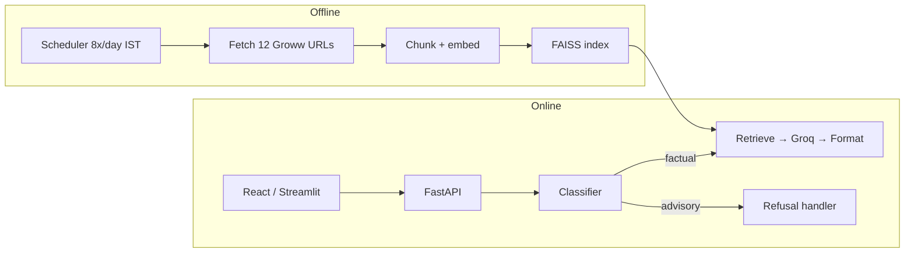

# HDFC Mutual Fund FAQ Assistant

A facts-only Retrieval-Augmented Generation (RAG) assistant over 12 curated Groww pages for HDFC mutual funds, ETFs, and related listings. It answers objective questions about expense ratio, NAV, exit load, benchmarks, and minimum SIP — and refuses investment advice, comparisons, and performance calculations.

> **Disclaimer:** Facts-only. No investment advice.

## Documentation

| Document | Description |
|----------|-------------|
| [Docs/ProblemStatement.md](Docs/ProblemStatement.md) | Requirements and success criteria |
| [Docs/Architecture.md](Docs/Architecture.md) | Two-path architecture (offline ingestion + online query pipeline) |
| [Docs/implementationplan.md](Docs/implementationplan.md) | Phase-wise build plan and configuration reference |
| [Docs/deploymentplan.md](Docs/deploymentplan.md) | Production deploy: Vercel frontend + Railway backend |
| [Docs/known-issues.md](Docs/known-issues.md) | Known limitations and workarounds |
| [Docs/validation-checklist.md](Docs/validation-checklist.md) | Automated test matrix (Phase 7) |
| [Docs/design.md](Docs/design.md) | UI design system and run commands |
| [frontend/README.md](frontend/README.md) | React frontend (Vercel) setup |

## Architecture (summary)



- **Offline:** APScheduler fetches Groww pages, updates `price_snapshots.json`, rebuilds the vector index (atomic swap).
- **Online:** Heuristic classifier routes queries; factual questions use local FAISS + BGE embeddings and Groq for phrasing; refusals use templates.
- **Embeddings:** Local BGE (`sentence-transformers`) — no API key required.
- **LLM:** Groq (`llama-3.3-70b-versatile`) — requires `GROQ_API_KEY` for factual answers only.

See [Docs/Architecture.md](Docs/Architecture.md) for the full component breakdown.

## Selected AMC and corpus

**AMC:** HDFC (via Groww public pages)

**Corpus location:** `data/corpus/groww/` (12 markdown files) + `data/corpus/price_snapshots.json`

| # | Scheme | Type | Local file |
|---|--------|------|------------|
| 1 | HDFC Silver ETF FoF Direct Growth | Mutual fund | `hdfc-silver-etf-fof-direct-growth.md` |
| 2 | HDFC Mid Cap Fund Direct Growth | Mutual fund | `hdfc-mid-cap-fund-direct-growth-2.md` |
| 3 | HDFC Flexi Cap Direct Plan Growth | Mutual fund | `hdfc-equity-fund-direct-growth-3.md` |
| 4 | HDFC Defence Fund Direct Growth | Mutual fund | `hdfc-defence-fund-direct-growth.md` |
| 5 | HDFC Small Cap Fund Direct Growth | Mutual fund | `hdfc-small-cap-fund-direct-growth-7.md` |
| 6 | HDFC Gold ETF Fund of Fund Direct Plan Growth | Mutual fund | `hdfc-gold-etf-fund-of-fund-direct-plan-growth.md` |
| 7 | HDFC Balanced Advantage Fund Direct Growth | Mutual fund | `hdfc-balanced-advantage-fund-direct-growth-11.md` |
| 8 | HDFC Silver ETF | ETF | `hdfc-silver-etf-6.md` |
| 9 | HDFC NIFTY Smallcap 250 ETF | ETF | `hdfc-nifty-smallcap-etf-9.md` |
| 10 | HDFC Gold ETF | ETF | `hdfc-mutual-fundhdfc-gold-exchange-traded-fund-10.md` |
| 11 | HDFC Bank Ltd | Stock | `hdfc-bank-ltd-1.md` |
| 12 | HDFC Life Insurance Company Ltd | Stock | `hdfc-standard-life-insurance-co-ltd-5.md` |

URL whitelist is defined in `src/config.py` (`CORPUS_ENTRIES`).

## Prerequisites

- **Python 3.11+**
- **Node.js 18+** (for the React frontend only)
- **Groq API key** — [console.groq.com](https://console.groq.com) (factual chat answers only)

## Setup

```bash
# Clone and enter the project
cd "RAG Milestone"

# Python virtual environment
python3.11 -m venv .venv
source .venv/bin/activate   # Windows: .venv\Scripts\activate

# Install dependencies
pip install -r requirements.txt

# Configure environment
cp .env.example .env
# Edit .env — set GROQ_API_KEY=gsk_...
```

Copy `frontend/.env.example` to `frontend/.env.local` when running the React app locally.

### Build the vector index (first run)

The repo may ship with a pre-built `index/` directory. To rebuild from corpus:

```bash
# Fetch latest Groww pages + update price snapshots + rebuild index (recommended)
python -m src.scheduler.jobs --once

# Or step by step:
python -m src.ingest.fetcher
python -m src.ingest.indexer
```

First embedding run downloads the BGE model (~130 MB).

## How to run

### Primary UI — React + FastAPI (local)

Two terminals:

```bash
# Terminal 1 — API backend
source .venv/bin/activate
uvicorn src.api.main:app --reload --port 8000

# Terminal 2 — React frontend
cd frontend && npm install && npm run dev
```

Open **http://localhost:5173/chat** — Vite proxies `/api/*` to port 8000.

Verify backend health:

```bash
curl http://localhost:8000/api/health
# Expect: "status":"ok", "index_ready":true, "groq_configured":true
```

> **Note:** After editing `.env`, restart the backend — uvicorn does not reload environment variables automatically.

### Scheduler (data refresh)

The scheduler is a **separate process**. It does not start with the API server.

```bash
source .venv/bin/activate

# Production schedule: 09:15 IST, then every 3 hours (8 runs/day)
python -m src.scheduler.jobs --daemon

# One-shot manual refresh (fetch + re-index)
python -m src.scheduler.jobs --once

# Dev: refresh every N minutes
python -m src.scheduler.jobs --daemon --interval-minutes 5
```

**Ingestion audit log:** Each run (manual or scheduled) appends a record to `data/ingestion_log.json` with timestamps, fetch counts, success/failure, and index `ingested_at`. Check it directly or via API:

```bash
# View last run in the log file
cat data/ingestion_log.json | tail -20

# Or via the backend
curl http://localhost:8000/api/ingestion
```

The log keeps the most recent **500** runs.

### Legacy UI — Streamlit (optional)

```bash
source .venv/bin/activate
streamlit run src/app/main.py
```

Open **http://localhost:8501**. The React app in `frontend/` is the primary UI for production (Vercel).

### CLI pipeline test

```bash
python -m src.rag.pipeline "What is the expense ratio of HDFC Defence Fund Direct Growth?"
```

## Testing

```bash
source .venv/bin/activate
python -m pytest tests/ -v
```

Focused validation suite (Phase 7):

```bash
python -m pytest tests/test_compliance.py tests/test_validation_matrix.py tests/test_hardening.py tests/test_integration.py -v
```

Optional live integration (requires built `index/` and `GROQ_API_KEY`):

```bash
export RUN_LIVE_INTEGRATION=1
python -m pytest tests/test_integration.py -v
```

## Deployment

| Component | Platform | Entry |
|-----------|----------|-------|
| Backend API | Railway | `Procfile` → `uvicorn src.api.main:app` |
| Frontend | Vercel | Root directory: `frontend/` |
| Scheduler | Separate worker or cron | `python -m src.scheduler.jobs --once` on a schedule |

Railway env vars: `GROQ_API_KEY`, `CORS_ORIGINS` (your Vercel URL), plus settings from `.env.example`. Build the index on deploy or use a persistent volume.

See [frontend/README.md](frontend/README.md) for Vercel steps.

## Configuration

All variables are documented in `.env.example`. Key settings:

| Variable | Required | Purpose |
|----------|----------|---------|
| `GROQ_API_KEY` | Yes (for chat) | Groq LLM factual answer generation |
| `LLM_MODEL` | No | Default `llama-3.3-70b-versatile` |
| `EMBEDDING_PROVIDER` | No | Default `bge` (local, free) |
| `TIMEZONE` | No | Default `Asia/Kolkata` (scheduler) |
| `CORS_ORIGINS` | Production | Comma-separated frontend URLs |

Full reference: [Docs/implementationplan.md § Configuration Reference](Docs/implementationplan.md#configuration-reference).

## Known limitations

- **12 schemes only** — questions outside the HDFC Groww corpus get an insufficient-context response.
- **No ELSS** in corpus — lock-in / tax-saving questions cannot be answered factually.
- **Groww as sole source** — not primary AMC factsheets; accuracy depends on Groww page content.
- **Stale data between runs** — NAV/prices refresh on scheduler runs (every 3 hours when daemon is running).
- **No investment advice** — advisory, comparison, and multi-period return queries are refused or deflected.
- **Portfolio / goals in UI** — demo mock data only; no PII collection.

Details: [Docs/known-issues.md](Docs/known-issues.md) and [Docs/Architecture.md § Known Limitations](Docs/Architecture.md#known-limitations).

## Project layout

```
src/
  api/           FastAPI REST API (Railway)
  app/           Legacy Streamlit UI
  ingest/        Fetcher, chunker, indexer, price parser
  rag/           Classifier, retriever, generator, formatter, pipeline
  refusal/       Advisory / performance refusal handler
  scheduler/     APScheduler jobs
  validation/    Response compliance checks
frontend/        React + Vite UI (Vercel)
data/corpus/     Groww markdown + price_snapshots.json
data/ingestion_log.json  Scheduler run audit trail (append-only)
index/           FAISS vector store (gitignored)
tests/           Unit, integration, and validation tests
Docs/            Architecture, design, validation, known issues
```

## License

Internal milestone / educational project. Groww page content remains subject to Groww's terms of use.
